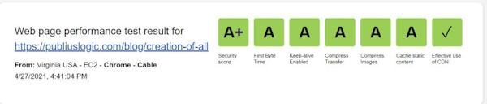
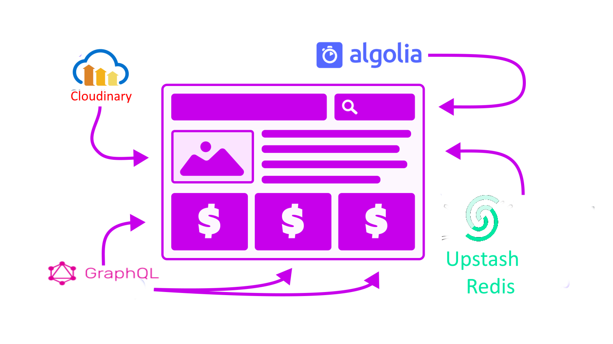

[](https://www.buymeacoffee.com/donaldboulton/w/3913)

## To Convey My Knowledge

I employ Feynman <Popper tooltipText="Wisdom Is the key to knowledge">Wisdom</Popper> in explications of Code, Government, Law and God with a little <Popper tooltipText="Wisdom according to Sufi">Sufism</Popper> Wisdom for brevity.

The 🔗 [Feynman Learning Technique](https://fs.blog/feynman-learning-technique/) is a simple way of approaching anything new you want to learn. ... When you really learn something, you give yourself a tool to use for the rest of your life. The more you know, the fewer surprises you will encounter, because most new things will connect to something you already understand.

🔗 [Sufism](https://www.theosophical.org/publications/quest-magazine/42-publications/quest-magazine/3894-sufi-practice), mystical Islamic belief and practice in which Muslims seek to find the truth of divine love and knowledge through direct personal experience of God. ... The Sufis are also generally known as “the poor,” fuqarāʾ, plural of the Arabic faqīr, in Persian darvīsh, whence the English words fakir and dervish.

And my approach to discussions of this world follow along with what Tim Addison said on [Empathy](https://tjaddison.com/blog/2021/12/dont-mistake-their-kindness-for-empathy/)

Although advice like “be unfailingly kind”, and “keep your feedback actionable, specific, and kind” sounds great, Chelsea Troy points out the problem with that statement, namely:

<Section>

> You can’t always be kind!
>
> > …it assumes that the feedback giver has control over whether their feedback is perceived as kind. And they don’t. from Transcript from lecture: Giving and receiving feedback.

My Works are not for a popularly contest, I seek the Holy Ones.

</Section>

## Biblical Reading Timelines

<Section>

If you read them in order they have a timely purpose, playtime is calling out the evil one's.

</Section>

<CenterItem>
  <Table />
</CenterItem>

## Security Policy and Reports

<Section>

PubliusLogic security is top notch using the latest Content-Security-Policy directives we receive a A+ rating 💯

</Section>

<Section>



</Section>

<Section>


</Section>

### To Tailwind CSS

<Section>

Went from sass to styled components now using Tailwind CSS and happy about its ease of use.

</Section>

## Just Having Fun

<Section>

  🍸 This website is built as static HTML with React component-modular Docker Container builds, using React components
  with GraphQL, Built with WebPack. Including a user data, todo's backend. The data structure is using a second github repo for json data on the fly with OctoCat Rest and a GitHub App for Auth.

</Section>

<Section>



</Section>

<Section>

  Served on Netlify via a continuous deployment (CD) workflow. Pull requests are automatically built into preview apps,
  while commits to the master branch trigger the production build and deploy onto Netlify CDN edge node infrastructure.
  Since the whole site is just a bunch of static files copied onto multiple CDN nodes around the world, time to first
  byte (TTFB) is consistently fast at around 1ms to 2ms. Instant Notifications through my Slack Bots or Gmail and phone
  notifications using Netlify Functions for my Mansbooks.com PubliusLogic.com workspace.
  
</Section>

## Starter Publius

🚀 This 🔗 [Repo v5](https://github.com/donaldboulton/publiuslogic.com-netlify/) stores the Gatsby site hosted at publiuslogic.com. 

I use it to write about my personal interests, ranging from theoretical physics and spiritual learning; to A Human Basic Instructions Manuel, web development and spending time outdoors... oh and not to forget breaking conventions like a React Site with Json-Ld per template for SEO, Internet Positioning, and a A+ security rating. 💯

<Section>

Feel free to reuse any part of this repo to create your own React site.

</Section>

### Server-less

<Section>

  🔥 No run time dependency or vulnerable server stack required Pre-built pages served over a CDN for fastest time to
  first byte Fast and cheap CDN scaling results in ultra-high availability worldwide Server-side processes abstracted
  into microservice APIs for reduced attack surface areas Modern Continuous Deployment (CD) Git workflows with instant
  rollbacks Headless CMS for complete separation from your app / site and with full version control Modern authentication
  methods such as OAuth 2 for ultimate security.

</Section>

## Authentication

Github and Google OAuth v2 with `react-use-googlelogin`

## Features

<SingleAccordion label='Site Features'>

PubliusLogic is a complex Gatsby - React Site and not for React programing beginners.

> ✔️ Complete Website Suite - Pages = Home, Blog, About, Privacy, Sitemap Index for tags, categories, pages and posts sitemaps, and a Contact form with Slack Notifications and Email.

- 🚋 Serverless Functions
- 🔏 Authentication (with Google Auth / Octokit)
- 🔐 Authenticated Serverless Functions (Netlify Functions)
- 😻 External Provider login with GitHub, Bitbucket, Google, etc.
- 🏠 Protected Routes Locked by Google Auth
- 👋🏼 Dynamic Client side Pages in React (enabling all the above)
- 🕵🏼‍♂️ Hide API Secrets from being exposed to Frontend

</SingleAccordion>

## Site Design

<SingleAccordion label='Site Design'>

- Github repos for Content and Asset Management
- SEO Friendly (Sitemap Index - 4 sitemaps, Schemas, Meta Tags, GTM etc.)
- Progressive Web App & Offline Support
- Tag Lists, Categories Listings and a RSS Feed for Blog
- Time to Read and a Table Of Contents
- Support for code syntax highlighting
- Share Support (Add if wanted Component Included)
- Automatic optimization of images in Markdown/MDX posts
- SVG design (unDraw, Hero Patterns, HeroIcons)
- Contact Form with Slack and and Email saved on getForm
- Full SEO support (via Gatsby Head) including Open Graph, Twitter Cards and Schema.org via JSON-LD
- Incremental Netlify Builds

</SingleAccordion>

## Resource Links

<SingleAccordion label='Site Resources'>

- 🔗 [Gatsby Starter Default](https://github.com/gatsbyjs/gatsby-starter-default)
- 🔗 [Gatsby](https://gatsbyjs.org)
- 🔗 [TypeScript](https://www.typescriptlang.org/)
- 🔗 [TailwindCSS](https://tailwindcss.com) and 🔗 [TailwindUI](https://tailwindui.com)
- 🔗 [HeroIcons](https://heroicons.com/)
- 🔗 [Hero Patterns](https://heropatterns.com/)
- 🔗 [HeadlessUI](https://headlessui.dev/)
- 🔗 [unDraw](https://undraw.co/) for illustrations
- 🔗 [MDX](https://mdxjs.com/) and [Markdown](https://www.markdownguide.org/)
- 🔗 [ESLint](https://eslint.org) for type\*checking
- 🔗 [Framer Motion](https://www.framer.com/motion/) Motion Animations
- 🔗 [Schema.org](https://schema.org/) and 🔗 [JSON for Linking Data](https://json-ld.org/)
- 🔗 [Open Graph](https://ogp.me/) used by 🔗 [Facebook](https://developers.facebook.com/docs/sharing/webmasters/#markup)
- 🔗 [Twitter Cards](https://developer.twitter.com/en/docs/twitter-for-websites/cards/overview/abouts-cards)

</SingleAccordion>

  It follows the 🔗 [JAMstack architecture](https://jamstack.org) by using Git as a single source of truth, and is deployed
  on Netlify.

<FindOutMore />

<Section>This website is open source (0BSD license) - fork it and customize for your needs.</Section>

<Section>

```git:title=OBSD-License {1,3,5}
Copyright (C) [year] by [copyright holder] <[email]>

Permission to use, copy, modify, and / or distribute this software for any purpose with or without fee is hereby granted.

THE SOFTWARE IS PROVIDED "AS IS" AND THE AUTHOR DISCLAIMS ALL WARRANTIES WITH REGARD TO THIS SOFTWARE INCLUDING ALL IMPLIED WARRANTIES OF MERCHANTABILITY AND FITNESS. IN NO EVENT SHALL THE AUTHOR BE LIABLE FOR ANY SPECIAL, DIRECT, INDIRECT, OR CONSEQUENTIAL DAMAGES OR ANY DAMAGES WHATSOEVER RESULTING FROM LOSS OF USE, DATA OR PROFITS, WHETHER IN AN ACTION OF CONTRACT, NEGLIGENCE OR OTHER TORTIOUS ACTION, ARISING OUT OF OR IN CONNECTION WITH THE USE OR PERFORMANCE OF THIS SOFTWARE.
```

</Section>

<Cta />

<WavyHr className="mt-1 mb-1 text-fuchsia-600" />
