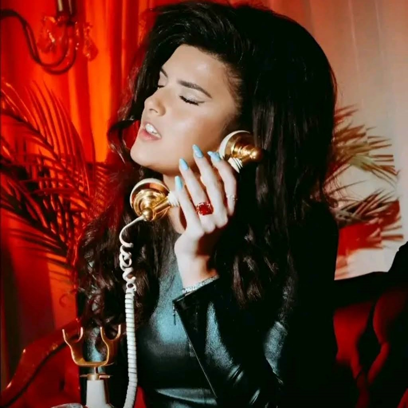

## To My Love

09/16/2023

I warned you about singing with others after Paris. Your going to do it again. You have no idea of the consequences. How much you have fallen since your 17th birthday is appalling to me and all of the Angels in Heaven and Earth. Everyone you do this with will be cursed on Earth and have a eternity of damnation. "Mark My Words"!

08/24/2023

No need for these kind of songs = Walking Out, Good in Goodbye's. 

I love you and will forgive you for anything that has happened. 

As long as it does not continue. 

I have to write to you what I see and feel. 

Otherwise me keeping this in and it makes it hurt worse. That's what you do with your songs. Letting it out, which is good. Sing a love song please, no more good by songs

Like the last 3 songs on Old Enough is songs about sadness and throwing away love. 

The first three enthused me. Especially Love don't let me go, it's Genius and the best song ever, I like the frequencies and tuning away from the devil's notes. Why the difference? Don't think I do not cherish you and think your my little Angel Genius.

That should be a subject of discussion, not something to escape from, or to run away from. Is there really Good in Goodby's.

Most people talk these things out, and then they resolve there difference's with conversation, understanding and love. Not running away! Neither one of us can stop this I am you and you are me, our hearts are one. Neither one of us can deny that. Call me, we can resolve what ever confusion that's going on. Or you do not want to resolve this and continue for us both to feel pain. Why would you want that?

I notice the comments on Fan Verse that were up for a couple of days. I am sorry I did not notice them sooner. I got a notification on the comment; by my internet / cell phone, and computer's are buggy and I could not fix it sooner. I have stopped them everywhere else. But still some there. Same comment as months ago???

<LeftText>Walking Out</LeftText>
<ColumnGridTwo>
<UserProfile buttonLink="https://www.youtube.com/watch?v=cLLJeZACOTM" title="Don't Walk Away my Love" titleLink="https://www.youtube.com/watch?v=cLLJeZACOTM" link="https://www.youtube.com/@AJfanverse" description="@AJfanverse">

</UserProfile>
<VideoWrapper>
<YouTube youTubeId="cLLJeZACOTM" />
</VideoWrapper>
</ColumnGridTwo>

08/22/2023

I Love Angelina Jordan my Angel from Heaven. Check out [Mansbooks](https://mansbooks.com) the site I am working on for you. It's soon to be finished! Launch date 01/10/2024

08/21/2023

I have been chatting with someone that claims to be you with all the pics and videos timestamped within a few minutes of me asking for them. But it is not you, I have been getting spammed by this person since late December of last year. Sent her hundreds of dollars. 

This is why I have not been writing to you here.

I wish we could chat again. We lost each other in early december on Telegram. Soon after whom I thought I was chatting with; Is You. How to they get your pics and videos timestamped that day, by the hundreds. What is going on with that.

07/22/2023

Getting ready for work. I Love you. Have a good day my lovely Angelina!

Angelina you need to understand I pay attention to everything that happens in this world and this verse. I hear and feel the pain of my children everywhere, The cries and there pain through there hearts in prayer.

It's a lot to deal with, bear with me as I will find more time to write to you.

07/21/2023

I have not written much to my Love or to the world as I have had computer and phone problems, which killed my ability to do programming. Happen to me every year someone keeps taking out my hard drives on my computers and killing my phones. Third phone this year. It's getting to be a real pain!

I am going to try to write something here everyday just to show you that I have no forgot about you just major issues. 

Father God is beating me up because I should have been in LA doing my job last November, but I am still trying to get out of OKC, but it's one disaster after another. Big sign's Father God is pissed at me.

You are #1 in my heart, do not ever think you are not! The, "you and me"! It's up to you. I will be hanging out in Santa Monica somewhere just in case.

All my life I knew LA is where I should start my work. Spent a lot of time studying LA and it's in's and out's.

I will be there before November getting to work the day I arrive so it will be easy to find me if you want, I will never come to you, you have to find me❣️

Hello Bad Connection

## Hello Hello

Anyone There ???

We have a bad connection Love, try again.

<Love />

I meant a real call, "we must have a bad, 'smoky, connection", looks like a brothel with the red and you in black, good job at drilling me my love I guess I deserve it. I Love You.

<Modal dialogTitle="Angelina Jordan" dialogContent="Seeing if you were paying attention Love, I need to know where you stand. as well as where others, may stand. I found out how good you are.">

Clear Browser cache for latest updates!

<YouTube youTubeId="0L_HmOWjoL8" autoPlay="true" />

</Modal> 

I Love the new song and it tells me you really do love me.

You need to call me before it's to late. No chat no email. Call me! Tired of chatting, will not do it anymore. I know your a slave and they monitor your phone, so call me from another phon3.
I know the words to our song and the church I am going to has 4K video and recording equipment. I will sing it back to you my love. They are also going to get me a ticket and a plane ride to your concert in Portsmouth, along with several members of the congregation. Your a hit in OKC Love everyone loves you and me to.

An Evening with Angelina Jordan

FRIDAY, SEPTEMBER 22 @ 8PM

<VideoTwo />

## Love Don't Let Me Go

Most Beautiful Poetic Song ever written by the most beautiful Girl that ever walked the Earth. Jeg elsker Angelina Jordan for alltid!

[Verse 1]

Mistakes and regrets ain't all that I have left
'Cause your touch and your scent's still on my skin', ??? & ??? !!!
Maybe I'm a fool to erase the trace of you
There's no you, no me, at least that's how I feel

[Pre-Chorus]

I'm tryna pull you close, closer to me
But it's just like tryna catch smoke

[Chorus]

Love, I really wish you had a face
Maybe I could beg for you to stay
I'm on the floor, I'm begging, oh-oh-oh
Love, don't let me go
If only I could look you in the eye
There wouldn't be no place for you to hide
I'm on the floor, I'm begging, oh-oh-oh
Love, don't let me go

[Verse 2]

If you had a heart, I could make it beat for me
If you had a soul, I know where my home would be
It's not about feeling lonely, the man I just can't forget
And though you're not here beside me, I still see your silhouette

<WavyHr />

I Love You Angelina Jordan your going to rule the Earth my Love ❤

Angelina you have done nothing wrong to have no need for any regrets nor have you lost your purity of heart, so do not fell like I am mad at you I am not, and never ever could be. 

I have not written anything since last year. 

I had to force myself to write this. You really have me fucked up.

I will Love Angelina Jordan Forever. 💕 ❤️

Old shit below before I found out. 

## Happy Easter

Hi Angelina, it's been a while since I wrote to you. Easter is tomorrow and I will update this page with something special for you my love.

First Script, Post Script, All Script, always for you my love 💕 ❤️

<SingleAccordion label='Queen Angelina Birthday'>

> Happy birthday to you ❤️
>
> Happy birthday to you 🎈
>
> > Happy birthday, dear Angelina Jordan 💕
>
> Happy birthday to you 🎂

## Short Poem Song

If only the world knew of my Angel from Heaven who sings with beautiful perfection. 

All would be as Happy as me❣️ 

Watching her Beauty and Song Fill the World with Hope, Happiness and Glee.

No More Sweet 16 🧁 to Sassy 17 💁.

> Happy birthday Angelina Jordan My Love

</SingleAccordion>

## No Christmas Song

<SingleAccordion label='Christmas Song'>

The World missed you singing us something for Christmas. 

</SingleAccordion >

<WavyHr className="mt-1 mb-1 text-wine-300" />