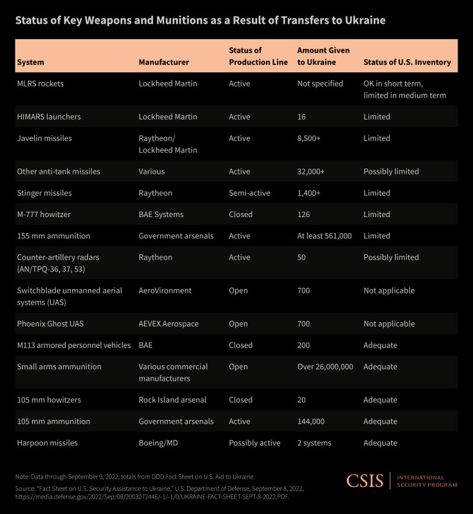

## Bullshit

Lots of bullshit below careful where you tread.

## Ukrainian War Lies

On the news the Russian army is destroying the electrical grid and water supplies, BULLSHIT like the rest of the war it's a scam to destablize NATO, RUSSIA, and the USA..

China is behind all of this like they have done to NATO country's and the USA for years. 

They pay off our Government Officials to devalue our cultures with lies LGTBQ, Mass Immigration, lawlessness and a major attack on christianity. 

Now we are using up all of our defensive weapons in Ukrainian. And not have the ability to stop a major invasion at the southern border, which will soon happen with military type attacks on the USA. How are we going to stop it, NUKE ourselves to kill the invaders in our town and city's. There are trying to give such an advantage to the invaders as trying to take our weapons.

All american citizens white or black need 50 cal water cooled machine guns and anti tank weapons now, or we are doomed the invaders have ours because of our sold out Government. Weapons form Ukraine and Afghanistan are being stockpiled in Mexico for this invasion. We get killed by the weapons we paid for. Thats really Good. 

Pay Attention of the white race and anyone around trying to protect you country's will be enslaved or killed.

It's happing mow. The electrical substations taken out by gun fire was just a test. What if they took out most all of the simply with guns all over the USA = CHAOS.

This is an attack on the White culture mostly because white people rule the world and control everything. Take out whity and who rules China.

They have the white race not even wanting to stay white as white people are evil and monsters. As any american kid and they will tell you the same thing. They have been convinced to do this for over 30 years not. 

Whity sucks, you have to interbreed or you prejudice and evil. 

All the White girls at any schools in the USA get pounded all the time that you have to be or sleep with other races and cultures or you prejudice and evil. I have nieces and cousin's with children and none of the girls married into there own race.

The Chinese have millions poring into NATO and the USA as we speak, to finalize the war or Whity so they can rule. The have destabized your countrys to the point wher ther is not strong nationaism so the people of these countrys just lay down. The USA is getting screwed by our own Governmant and even X-Military just lay down when our country is being invaded in our Airports, Shipping Ports and our borders with people that will destroy our infrastructur within a day and kill anyone's ability to fight back because we will be fighting over food and essentials.

## USA Kamikaze Drones

Read the following NATO and USA Two Face Lies and Bullshit.

Months ago the US sent several types of aerial weapon systems to Ukraine.

These include Switchblade drones – small, portable kamikaze drones that can carry a warhead and detonate on impact. The Switchblade 300 and the larger Switchblade 600 are produced by American defense company AeroVironment

## Russian Kamikaze Drones

- 10/17/2022

Kyiv was struck by so-called "kamikaze" drones on Monday, unleashed by Russia but believed to be Iranian-made.

The US agrees with the French and British assessment that the drones violate UN Security Council Resolution 2231, the US State Department said.

That resolution, linked to <Popper tooltipText="Biden has already violated the Accord">Iran's nuclear accord</Popper>, bars Iranian transfers of certain military technologies.

Ukraine has identified the drones - or unmanned aerial vehicles (UAVs) - as Iranian Shahed-136 weapons. They are called kamikaze drones after the Japanese fighter pilots who flew suicide missions in World War Two.

"It is our belief that these UAVs that were transferred from Iran to Russia and used by Russia in Ukraine are among the weapons that would remain embargoed under 2231," said Vedant Patel of the state department.

Iran denies supplying them to Russia, but Mr Patel said the US "exposed publicly that Russia has received drones from Iran, that this was part of Russia's plan to import hundreds of Iranian UAVs of various types".

He added that there was "extensive proof" of Russia's use of them in Ukraine.

## Nord Stream Pipeline

The USA Bullshit about Russia blowing up there own pipelines, has to be the most stupid lie of the Millions of lies the Biden admin has told us because Russia could shut down Nordic 1 and 2 lines anytime they wanted with a push of a button, or turn them back on. Which is perfect leverage to manipulated the people of europe against supporting the, "Anti-Christ Zelenskyy", in his USA / NATO puppet proxy war.

Now exports from the USA expensive Natural Gas to Europe.

USA Terrorism. Next will be communications and more pipelines. Path One USA Government is going to kill the whole planet and Nato loves it look at the European stupid idiots and there rich people controlling thieving Governments, at least Italy is trying to break from LGTBQ / Woke thief insanity. You all could be glowing soon from radioactive title waves. Then how will you survive in your shelters flooded with blood, sorrow and radioactive waters.

> Second path crop failures on a global scale with mass starvation starting in early 2024.
>
> > Last and final path. Very Soon You Will release my Love from her bondage and let her choose her own path, or the Whole World will feal my pain and my wrath.
>
> > > Or all the above will be irrelevant.

## Tucker Carlson

Asking obvious questions is forbidden

<Section>

<YouTube youTubeId="E0Abayg3k_o" autoPlay="true" />

</Section>

## Ukraine War

<Section>

<YouTube youTubeId="LNUe3djqlf8" />

</Section>

<Section>

> Kind of fell in Love with the Zelenskyy's, singing Endless Love, in the above video.
>
> > How Beautiful!

But is that not what enter-tainer's do, they capture you with song and there presents, and seek power over you using there God given gifts, to controlling Devilish pursuits.

> But what are there truths?

</Section>

## Bunch of Bullshit

🔗 [Hour Long Video Reveling Ukrainian and NATO Lies](https://youtu.be/dcp0TYx_eUI)

<Section>

Most of the immorality and worshiping the flesh is coming from the Haters of God and Man and thats Hollywood and entertainers in all forms. All they care about is money and, "Look at Me"!

Useless hater's, evil people that fill your minds with hateful idealism, sexism and immorality. The World would be better off without them, as it will soon be!

</Section>

🔗 [Jesse Watters on Hollywood Scum](https://youtu.be/YwePSc0VutM)

<Section>

Putin is doing what he is supposed to be doing, Ukraine is a NATO puppet and a war monger country just like USA Congress and most all GOV officials. Evil Liers, Murders, Pussies and Scum.

Why is Ukraine the West's Fault? Featuring John Mearsheimer, Professor in the Political Science Department at the University of Chicago.

</Section>

<Section>

<YouTube youTubeId="JrMiSQAGOS4" />

</Section>

A Indian view on the truth behind this Bullshit in Ukraine.

🔗 [Palki S Upadhyay](https://youtu.be/Kn2TCq6R8Tw)

🔗 [Another World View](https://youtu.be/GEIFwLKlq1Q)

<Section>

America you want to follow our drug dealing terrorist GOV to our destruction? How many times are you going to accept this Police action proxy war shit!

> Over the Nazi terrorist aggressor Ukraine?

6 months ago, 90% of you had no clue of anything about Ukraine or where it is located, now your willing to get us all killed because of Ukrainian, USA and NATO lies.

How many wars are they going to get us into before you figure this out, I had it figured out after Vietnam, it was extremely evident of there war monger terrorist ways!

- 4/27/22 update

</Section>

## Weapons Usage

<Section>

Biden is giving all our technology and weapons to Ukrainian Nazi thieves, we are down two thirds of our inventory on critical weapons to fight a war. At current production rates it will take 10 years to replace what he has already given them and about a trillion dollatrs on defense industry upgrades to increase productions. The people of the USA go into dept for that one also. So this proxy war has actually already cost us in product's, product replacements, interest on borrowed money from China about 2.2 trillion dollars in 8 months for a Nazi war.

🔗 [CNBC The U.S. and Europe are running out of weapons to send to Ukraine](https://www.cnbc.com/2022/09/28/the-us-and-europe-are-running-out-of-weapons-to-send-to-ukraine.html)

</Section>

<Section>

Overview of pledged and/or delivered weapons (see timeline below for more details and links) \*

- Australia: M113 armored personnel carriers, Bushmaster protected mobility vehicles, missiles, and weapons - AUD $285 million ($200 million), six M77 155mm howitzers, four 14 M113AS4 Armored Personnel Carriers; drones and 34 armored vehicles (valued $68 million)

- Belgium: 200 anti-tank weapons and 5,000 automatic rifles/machine guns; heavy machine guns, ammunition, non-lethal equipment for the winter including helmets, spare provisions and night vision equipment

- Canada: 8 armored vehicles, M777 howitzers, 4500 M72 rocket launchers and up to 7500 hand grenades, 20,000 155mm artillery shells, as well as $1 million dollars for the purchase of commercial satellite high resolution and modern imagery​, machine guns, pistols, carbines, 1.5 million rounds of ammunition, sniper rifles, and various related equipment ($7.8 million), plus additional $20 million in military aid (CAD $25 million - details undisclosed)-- CAD $118 million total (as of April 22) -- and an additional CAD $500 million on May 8 (undefined), 39 armoured combat support vehicles (ACSVs)

- Croatia: rifles and machine guns, protective equipment valued at 124 million kuna (€16.5 million)

- Czech Republic: T-72 tanks and infantry fighting vehicles; attack helicopters (Mi-24); rocket systems; 400 million koruna ($18.23 million) of non-light weapons, including 160 shoulder-fired MANPADS systems (probably 9K32 Strela-2), 20 light machine guns, 132 assault rifles, 70 submachine guns, 108,000 bullets, 1,000 tactical gloves, all worth 17 million crowns ($756,000), and an earlier 188 million koruna ($8.6 million) worth of 4,000 mortars, 30,000 pistols, 7,000 assault rifles, 3,000 machine guns, a number of sniper rifles, and one million bullets.

- Denmark: Harpoon anti-ship launcher and missiles, 2,700 anti-tank weapons, 300 Stinger missiles (returned to United States to be made operational), protective vests

- Estonia: Javelin anti-tank missiles; nine howitzers (with German permission)

- European Union: €2 billion for military supplies, €500 million in military aid

- ​Finland: 2,500 assault rifles and 150,000 cartridges for them, 1,500 single-shot anti-tank weapons, and combat ration packages

- France: MILAN anti-tank guided missile systems and CAESAR artillery howitzers, plus “additional defense equipment,” 6 CAESAR howitzers (June)

- Germany: 24 Gepard anti-aircraft tanks, 50 Cheetah anti-aircraft systems, 56 PbV-501 IFVs, 1,000 anti-tank weapons and 500 Stinger anti-aircraft defense system, plus permission for select other countries to send weapons controlled by Germany, three M270 Mittleres Artillerie Raketen System (MARS) launchers and GMLRS ammunition, 100 tank howitzers, 16 Biber bridge-layer tanks (official page)

- ​Greece: portable rocket launchers, ammunition, and Kalashnikov rifles

- Ireland: 200 units of body armor, medical supplies, fuel, and other non-lethal aid

- Italy: Cabinet approved transfer of military equipment, pending Parliamentary approval.- reported to include Stinger surface-to-air missiles, anti-tank weapons, heavy machine guns, MG-type light machine guns and counter-IED systems

- Japan: bulletproof vests, helmets, and other non-lethal military aid; civilian vans and UAVs

- Latvia: six 155mm self-propelled Howitzers, four helicopters, Stinger anti-aircraft missiles

- Lithuania: Stinger anti-aircraft missile systems and ammunition, M113 and M577 armored personnel carriers and ammunition; 105-mm howitzers; 50 M113 armored vehicles

- Luxembourg: 100 NLAW (Next Generation Light Anti-Tank Weapon), Jeep Wrangler 4x4 vehicles, 15 military tents, and additional non-lethal equipment

- Netherlands: 200 Stinger missiles, 3000 combat helmets and 2000 fragmentation vests with accompanying armor plates, one hundred sniper rifles with 30,000 pieces of ammunition, plus other equipment; 400 rocket-propelled grenade launchers (with German permission), heavy weapons, self-propelled howitzers, armoured vehicles

- North Macedonia: unspecified military equipment, unspecified number of soviet-era tanks

- Norway: 100 Mistral air defense missiles, 4,000 anti-tank weapons, helmets, bulletproof vests, other protection equipment, 22 M109 155m tracked self-propelled howitzers and related materials, three MLRS long-range rocket artillery (joint donation with UK), Hellfire missiles

- Poland: 200+ T-72 tanks, other approved delivery of Piorun (Thunderbolt) short-range, man-portable air defense (MANPAD) systems and munition; Defense Minister expressed readiness to supply several dozen thousand rounds of ammunition and artillery ammunition, air defense systems, light mortars, and reconnaissance drones, three Krab 155m self-propelled howitzer squadrons (worth $700M)

- Portugal: grenades and ammunition, G3 automatic rifles, and other non-lethal equipment

- ​Romania: €3 million of fuel, bulletproof vests, helmets, ammunition, military equipment, and medical treatment

- Slovakia: S-300 air defense system, eight self-propelled Zuzana 2 howitzers.

- Slovenia: T-72 tanks (reported), undisclosed amount of Kalashnikov rifles, helmets, and ammunition; 28 Slovenian M-55S tanks

- Spain: 1,370 anti-tank grenade launchers, 700,000 rifle and machine-gun rounds, and light machine guns, 20 tons of medical supplies, defensive, and personal protective equipment composing of helmets, flak jackets, and NBC (nuclear-biological-chemical) protection waistcoats

- Sweden: 10,000 AT4 anti-tank weapons, helmets, and body shields; anti-tank weapons and machine guns (valued $40 million)

- Turkey: co-production of Bakar Bayraktar TB2 armed drones​

- United Kingdom: anti-aircraft capabilities (Stormer), 10,000 short-range and anti-tank missiles (including NLAWs and Javelins), Saxon armored vehicles, Starstreak air defence systems, loitering munitions, radar, heavy lift drones -- with aid at £200 million, to rise to as high as £500m as of April 25 (note: on April 8, reports indicated aid already at £350 million)-- on May 2, an additional £300 million announced, M270 multiple-launch rocket systems (quantity to be announced), $1.2 billion (air defense systems and other technologies), three MLRS long-range rocket artillery (joint donation with Norway); 50,000 artillery shells, artillery guns, drones, anti-tank weapons, additional MLRS, precision guided M31A1 missiles (See also Sept 21 report from UK House of Commons Library)

- United States: more than 170 Howitzers and more than 1,000,000 artillery rounds; laser-guided rocket systems; Switchblade, Puma, and Counter-Unmannered Aerial systems​; about 700 Phoenix Ghost Tactical Unmanned Aerial Systems; counter-artillery radars; 38 High Mobility Artillery Rocket Systems (HIMARS) and HIMARS ammunition; eight Surface-to-air Missile Systems (NASAMS); HARM missiles; 1400 Stinger and 8500 Javelin missiles; 1500 TOW missiles; 20 Mi-17 helicopters; ​anti-armor systems, small arms and various munitions; more than 60 millions rounds of small arms ammunition; body armor; hundreds High Mobility Multipurpose Wheeled Vehicles (HMMWVs). Total $17.5 billion in security aid since the Biden Administration began, as of October 4, 2022. (Factsheet, October 4)

</Section>

<Section>

That's 1,503 of the 17,000 anti tank weapons used, and they want more. Out of the 17,000, where are the rest of them, they are being sold on the Black Market and distributed to our enemy's.

> Now it’s the Phoenix Ghost unmanned aerial system built by AEVEX Aerospace, but not listed on its website. The Pentagon is sending 121 of the drones to Ukraine which can provide both reconnaissance and attack, with the emphasis on attack.
>
> > This is some of our most Hi-Tech stuff and we just gave it away to the World via Ukraine. Bet Congress did not even know of the Phoenix Ghost like they did'nt know about hypersonic missiles!

Now were are paying Ukrainian GOV salary's.

Yellen says U.S. to give Ukraine another $500 million to help Ukraine pay government salaries, pensions and fund social programs necessary to avoid a worsening of the humanitarian condition.

</Section>

<Section>

We should also sent humanitarian aid nurses to wipe there ass. Ukraine and Biden are playing us like the Devil with her fiddle. At the destruction of the USA.

The weapons we send cost a lot more to replace than it did to make them, this will be another Biden spending fiasco that will end up costing us trillions of more dollars on our national debt.

Buying the weapons twice shipping and interest on the money will break the USA, but is that not what Biden has been doing all along. Financially destroying the USA.

Watch the Below video which is a series of video's on the evil of the Ukrainian GOV and Zelenskyy, and really what caused the war = NATO.

</Section>

🔗 [Ukrainian Evil](https://youtu.be/TzgPJeYZaOU`)

<Section>

1. Ukrainian BS

> Fake News, the whole Ukraine/Russia war is B.S. and not really even a war.
>
> > Russia has the capabilities to level Kiev or any other city with its high altitude bomber's, supported by thousand's of Support Fighter Jets and Drones.

</Section>

## Fake productions

<Section>

What a puppet jerk! Trying to get us all killed!

</Section>

<Section>

Russia's Air Force could have taken out the Communication and Command Structure, Communication infrastructure, Electrical Grids, Fuel supplies, Military instillation's, Ammo dumps and all resupply routs the first night of the war.

They could have used hypersonic missiles to take out the Kiev GOV building's and Command Infrastructure without the Ukrainian's knowing they were coming, thus taking out Zelenskyy and most GOV officials.

Then give Ukraine 48 hours to surrender or Russia could and would, "Arc Light, 'Incinerate", Kiev, Lviv, and The Port City of Marupol, not using WMD.

</Section>

<Section>

Stalin said its better to go to far, than not far enought!

> In any war your objective is to defeat the enemy. By any means necessary!
>
> > War Crime's what a joke, War is a crime, "Always"!
>
> > > And by all participants.

Intergalactic wars are not just necessarily against differing forms of Man but between Planets the objective then is to eliminate your enemy by killing there planet and thus, there form of mankind; then you have no future enemy's.

</Section>

<Section>

Kill them all is the only logical course!

2. Body bags

Fake Fake FAKE, the Russians used no body bags on Ukrainian citizens just buried them without wasting body bags.

> The body bags you see are staged Ukrainian lies.

With scenes of them on top of the Russian dug graves, or with alive people in them for a good show! Comedian's, Lier's and staged crap. Just like Hollywood, "all lies and immorality".

</Section>

## Command

<Section>

There is no way the command structure of Ukraine should still be intact, the first thing in any modern war is to take out command and control, not one cruse missile has come close to Kiev GOV buildings nor have they taken out the electrical grid to stop Zelenskyy from begging the World for more weapons and money.

Russia has not stopped the influx of weapons from Poland which could easily be done by destroying the Roads, Railways and Highways.

Some would say they could use backup generators for communication or Starlink, well true, then satellite's could detect the infrared signatures from the generator's, so they could be easily found and targeted, so this is not a war this is the USA getting played by Russia, China and Zelenskyy, to further destabilize the USA and leave us defenseless.

All the weapons we left in Afghanistan and now we are giving away our critical defense weapons to Ukraine. These weapons systems are hard to replace and are needed for the USA if we were to get into a conflict.

</Section>

<Section>

A lot of the parts and raw material for these weapon's systems come from overseas. We do no mining of the minerals in the USA the EPA has seen to that, so in any War we are screwed, no oil reserves, no manufacturing or mining capabilities, were are messing up and getting taken over by Russia China and Mexico. I wonder who get's what.

Congress needs to Check our stockpile but they wont there in on this to, any smart country keeps these weapons for there own defense, like Germany announced they just did not have enought share with the Ukraine's. But our Congress will leave the USA defenseless on this internal war Biden is going to start here in the USA.

Has anyone seen a Patriot missile defense system here in the USA, or to we have any missile defense I bet not we give it to NATO and to Saudi Arabia, and we have ZERO land based air defense systems.

</Section>

<Section>

25% of America is people who just moved here and 18% of them are illegal. At the end of Biden's term we will have 30% of our population illegal Aliens they love America but hate American's.

And worst of all they have taught our children laydown and hate the USA and not stand up to fight for us if needed. Thats all the invader's destroying our National pride.

How could you have pride in your country when it's full of scum from South of the border telling our kids we are veil and they have the right to come get our country and our lives.

</Section>

Evil

🔗 [Dan Bongo on Pure Evil](https://youtu.be/fcnO1QZ5a_o)

## Revelations

<Section>

Revelation 22 for 2022

The Book of Revelations are from 2000 to 2022, marking the years of my time.

</Section>

### 11

<Section>

> Remember my Children, Let him who does wrong continue to do wrong; let him who is vile continue to be vile; let him who does right continue to do right; and let him who is holy continue to be holy."
>
> > Let him whom professes evil continue to profess evil!

I will give you the trinity of Man on 4/17/2022, then all will know of the evil, ones.

</Section>

<CalloutDanger>

<Section>

I will be continually updating this page with more B.S about GOV, War, USA, any kind of Bullshit even Bullshit about Bullshit!

</Section>

</CalloutDanger>

<WavyHr className="mt-1 mb-1 text-fuchsia-600" />
