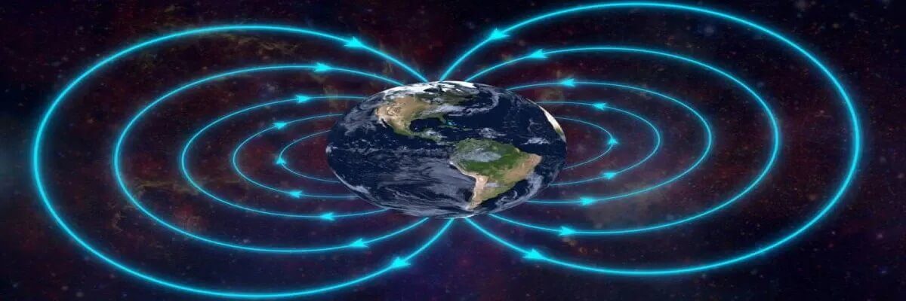
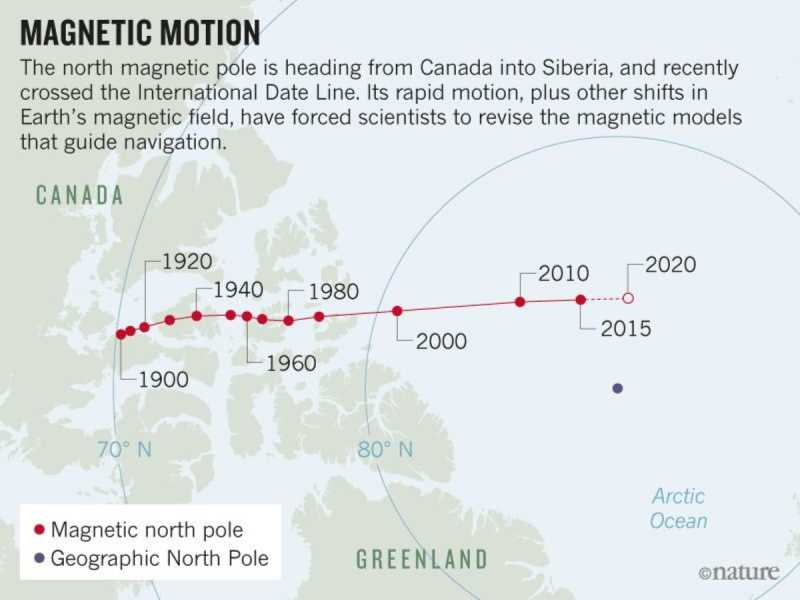

## Common Sense on Planetary Issues

Original Post dated: 2020-03-02

🌎 As a child I could not get enough information on Planetary issues.

I had subscriptions to all info on science and anything mechanical.

I found the magnetic flux of our planet to be quite intriguing.

<Section>

🌐 Over the years paying attention the the magnetic flux changes it became clear to me that these changes were do to mankind using up the riches of Mother Earth as in oil, iron gold and other minerals that were high in there magnetic attractions and introducing dielectric properties, thus decreasing the magnetic attraction to those areas in Mother earth.

Therefore changing the magnetic flux density points around the earth. 

Basically the Mother used these Magnetic flux points to balance her self and control her spinning rates.

Even the magma placement or dis-placement is controlled by earths magnetic flux not the other way around.

[Scientific Articles on Magma displacement](https://www.popularmechanics.com/science/environment/a32496561/why-magnetic-north-pole-moving/)

</Section>

<Section>

<YouTube youTubeId="HEj4p8Ax3b4" />

</Section>

## Magnetic Motion

<Section>

</Section>

<Section>

We pump out the oil, store it above ground in areas away from where it came from and then send it up into our atmosphere.

Distribute the minerals all over the place and the mother cannot balance herself, and we all die.

All from our formalized and complete, stupidity and greed.

</Section>

## Stop the Drilling

I have not said anything about the Biden Administration's attack on the oil industry, because this should have been started in the 60's and slowly progressed to clean energy of any kind by the 90's.

So it's about time. The way he is going about it is really stupid, these thing cannot be done effectively when you ony have several types of renewable energy available, and the WIND / Solar and electric Vehicles only increase Global Warming because of the Mining, shipping and the industrys behind them are not using clean energy resources. 

> First thing's first Dumb Asses.

Cannot expect much from a bunch of Ivy League idiots bent on Making money instead of common sense. Following the Chinese and Elon Musk into further lithium stupidity.

Geo Thermal would keep the driller's in the old oil industry busy, using natural Gas could supplement coal and oil for electrical generation.

The lithium deposits need to stay where they are at, or to further destabilization of the planet.

## Lithium and its magnetic attraction

Read: [Magnetic properties of lithium intercalation compounds](https://link.springer.com/article/10.1007/s11581-006-0007-5)

The above applies to Earth as well as semiconductors and batteries.

<Section>

## Geo Balancing

NASA / Elon Musk, Pull your heads out of Outer space, "Being totally Spaced Out", and focus your knowledge on what important and thats earth and use which little sense you have left or could muster to stabilize the planet. 

No Offense Elon. Most of the time I love ya, Blessing's My Love!

NASA Fuck Off!

Quit playing around and destroying Earth, punching holes in our Atmosphere, with mass amounts of carbon dioxide from your, "Rockets", thus further increasing the pollution and destabilization of Planet Earth.

more, More, MORE / money, Money, MONEY!

</Section>

<WavyHr className="mt-1 mb-1 text-fuchsia-600" />
