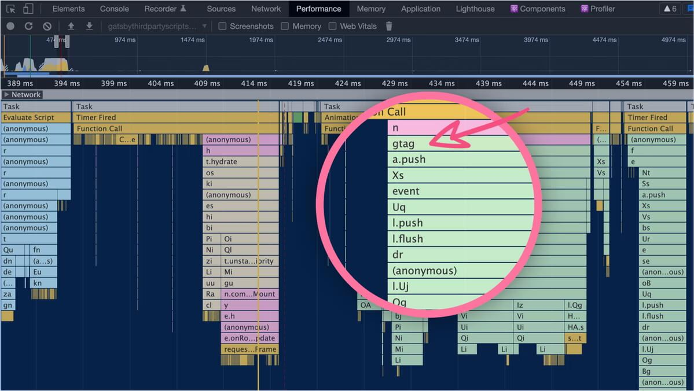
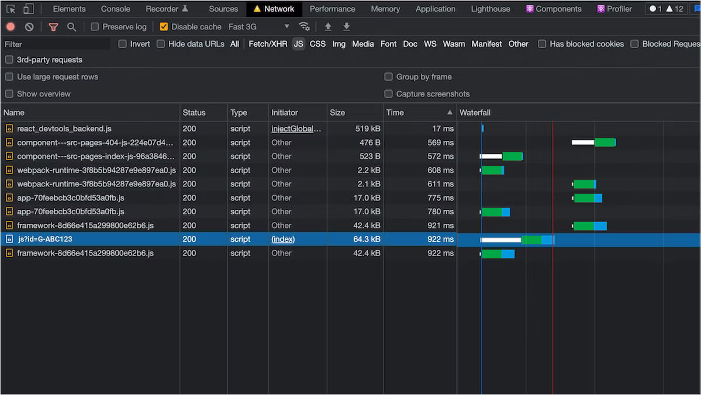
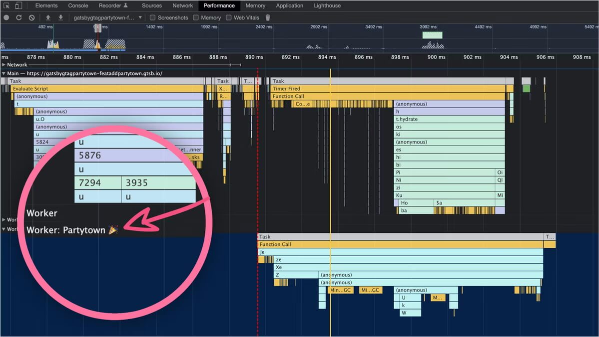

<Center>Gatbsy Partytown WebWorker!</Center>

## Partytown

🔗 [Partytown By builder.io](https://partytown.builder.io/) is a lazy-loaded library to help relocate resource intensive scripts into a web worker, and off of the main thread.

Its goal is to help speed up sites by dedicating the main thread to your code, and offloading third-party scripts to a web worker.

🔗 [Gatsby Post On Partytown](https://www.gatsbyjs.com/blog/how-to-add-google-analytics-gtag-to-gatsby-using-partytown/)

🔗 [Repo for the changes](https://github.com/PaulieScanlon/gatsby-gtag-partytown/pull/1/files)

## Why is it important

It’s important because third-party scripts have a habit of slowing down the time it takes for your website to load, and a slow-to-load website isn’t good for users, or performance metrics…. or $business!

What we know: Loading third-party scripts on the main thread impacts performance by delaying the time it takes for your site to become available and ready to use by your end users.

You can see from the below that amongst that mess on the Performance tab is the gtag script which is getting in the way of the application JavaScript – Blurg 🤢



You’ll also notice on the Network tab that js?id=G-ABC123 is actually loaded before some of the more essential application JavaScript – Yikes! 😲



But with Partytown, third-party scripts are offloaded to a web worker (which runs in its own thread), which means your site is available more quickly to your end users.

Your users thank you, your business thanks you, and we thank you for making a faster web!

## Warning

⚠️ A word of warning

I should point out that Partytown is currently in BETA and the method I’m about to describe can also be considered BETA! – It does work but it could change in the future!

…but fear ye not! I have it on good authority that a Script component will be coming to Gatsby later in 2022 and all of the Partytown goodness I’m about to explain will be baked in and ready for you to use in the usual sweet, sweet Gatsby way! 💜

Oh also, before I forget, we’ve added some of the methods used in this post to the official Partytown docs, these can be found on the following links.

## Partytown Builder.io

🔗 [Integrations](https://partytown.builder.io/gatsby)

🔗 [Proxying Requests](https://partytown.builder.io/proxying-requests)

## My Implementation

I just changed my file's like the plugin, `gatsby-gtag-partytown`, would do.

Remove any modules as in, `gatsby-plugin-google-gtag` or google analytics

```bash:title=uninstall {1}
npm uninstall gatsby-plugin-google-analytics || gatsby-plugin-google-gtag
```

## gatsby-config.ts

```ts:title=gatsby-config.ts {6-14}
module.exports = {
  siteMetadata: {
    title: 'gatsby-gtag-partytown'
  },
  plugins: [
-    {
-      resolve: 'gatsby-plugin-google-gtag',
-      options: {
-        trackingIds: ['G-C60YCNF3ND'],
-        pluginConfig: {
-          head: true
-        }
-      }
-    }
   ]
  }
};
```

## Add to .gitignore

```diff:title=.gitignore {3-5}
  # TernJS port file
  .tern-port
+
+ # Partytown
+ static/~partytown
```

## package.json

```diff:title=package.json {1-2}
+ "@builder.io/partytown": "^0.5.0"
- "gatsby-plugin-google-gtag": "^4.22.0"
```

## gatsby-ssr.tsx

> Google Analytics GA4 property

```tsx:title=gatsby-ssr.tsx {2,4-5,7-8,10-23,25-36}
import * as React from 'react'
import { Partytown } from '@builder.io/partytown/react'

const ORIGIN = 'https://www.googletagmanager.com'
const GATSBY_GA_MEASUREMENT_ID = 'XXX-XXXXXXX'

export function onRenderBody({ setHeadComponents, setPreBodyComponents, setHtmlAttributes }) {
  if (process.env.NODE_ENV !== 'production' && process.env.NODE_ENV !== 'test') return null
  setHtmlAttributes({ lang: 'en' })
  setHeadComponents([
    <Partytown key="partytown" forward={['gtag']} />,
    <script key="google-analytics" type="text/partytown" src={`${ORIGIN}/gtag/js?id=${GATSBY_GA_MEASUREMENT_ID}`} />,
    <script
      key="google-analytics-config"
      type="text/partytown" // You can add other external scripts below, adding this type to all
      dangerouslySetInnerHTML={{
        __html: `window.dataLayer = window.dataLayer || [];
        window.gtag = function gtag(){ window.dataLayer.push(arguments);}
        gtag('js', new Date());
        gtag('config', '${GATSBY_GA_MEASUREMENT_ID}', { send_page_view: false })`,
      }}
    />,
  ])
  // Below is Optional for Disabled JS
  setPreBodyComponents([
    <noscript
      key="gtm"
      dangerouslySetInnerHTML={{
        __html: `
                  <iframe src="https://www.googletagmanager.com/ns.html?id=GTM-XXXXXXX" height="0" width="0"
                      style="display:none;visibility:hidden"></iframe>
                `,
      }}
    />,
  ])
}
```

There’s quite a lot going on here, so let me talk you through it.

## onRenderBody

onRenderBody is one of gatsby-ssr’s extension points and runs after each page is created by Gatsby. It can be used to set HTML <head /> or <body /> elements.

## gatsby-browser.tsx

````tsx:title=gatsby-browser.tsx {1-4,5-11}
export const onRouteUpdate = ({ location }) => {
  if (process.env.NODE_ENV !== 'production') {
    return null
  }

  const pagePath = location ? location.pathname + location.search + location.hash : undefined
  setTimeout(() => {
    if (typeof gtag === 'function') {
      gtag('event', 'page_view', { page_path: pagePath })
    }
  }, 100)
}
``

To set `<script />` tags in the HTML `<head />` you can use the setHeadComponents function.

There’s an if condition right at the beginning to ensure the script tags and Partytown component aren’t added while in development

`<script />`

I’d like to draw your attention to the type on the <script /> tag. Usually you’d expect to see type="text/javascript" but with Partytown this has changed to type="text/partytown".
This is so later on, when Partytown does its thing it’s able to locate the <script /> tags to offload to web workers. More on that in a moment.

It’s also worth pointing out that the actual gtag script is ever so slightly different to the example given on the Google docs: Install the global site tag, i’ll explain why in a moment. – Read on 💅

`<Partytown />`

The `<Partytown />` React component can be configured using regular React Jsx props. You can read more about the Partytown React component in the docs, but I will explain the forward prop as this is where things can get a little complicated.

The forward Prop “Problem”

If you have a look at Google’s recommended approach you might notice some differences between the code snippet i’ve used above and the one shown in: Add gtag.js to your site.

There’s a small but important difference shown here in the diff.

```diff:title=gtag function diff {2}
- function gtag(){window.dataLayer.push(arguments);}
+ window.gtag = function gtag(){ window.dataLayer.push(arguments);}
````

When Partytown moves scripts into a web worker it creates a kind of clone of the window object, and when it does, function gtag() isn’t hoisted onto the cloned window object.

By defining window.gtag = function gtag() we can ensure that the gtag function as referenced by the forward prop will exist on the Partytown cloned window object.

Hat tip to Ward Peeters (Gatsby’s Principal Engineer, Tech Lead Open-Source) for this solution 🎩.

There’s one other small difference in the code snippet. Here’s the diff.

```diff:title=send_page_view {2}
- gtag('config', '${GATSBY_GA_MEASUREMENT_ID}')
+ gtag('config', '${GATSBY_GA_MEASUREMENT_ID}', { send_page_view: false })
```

To ensure that a page view isn’t sent once the script is loaded you can set send_page_view to false.

In the next section I’ll explain how you can fire off events containing location data. For reference here’s the Google docs for: Measure Google Analytics Events.

## Sending events gatsby-browser.tsx

```tsx:title=gatsby-browser.tsx {1-4,6-12}
export const onRouteUpdate = ({ location }) => {
  if (process.env.NODE_ENV !== 'production') {
    return null;
  }

  const pagePath = location ? location.pathname + location.search + location.hash : undefined;
  setTimeout(() => {
    if (typeof gtag === 'function') {
      gtag('event', 'page_view', { page_path: pagePath });
    }
  }, 100);
};
```

## onRouteUpdate

The onRouteUpdate function is called when the user changes routes, including on the initial load of the page. You can access the current location from the destructured props.

As with onRenderBody there’s an if condition right at the beginning to ensure the gtag event isn’t called while in development, and then inside a 100ms setTimeout is where you can fire off any event you like. I’ve called this one page_view and passed in a pagePath which can be constructed from properties contained within the location prop. The 100ms delay is required to ensure all side-effects such as React Helmet setting titles etc are complete before the gtag event is fired.

Once deployed you can see on the Performance tab in Chrome Dev Tools that Partytown is now taking charge of loading the Google Analytics script and waits until the main thread has finished loading / parsing all of your important application JavaScript (indicated by the red line in the image below) – Lovely stuff! 🥳



## gatsby-node.ts

```ts:title=gatsby-node.ts {1-2,4-6}
const path = require('path');
const { copyLibFiles } = require('@builder.io/partytown/utils');

exports.onPreBuild = async () => {
  await copyLibFiles(path.join(__dirname, 'static', '~partytown'));
};
```

## onPreBuild

The onPreBuild extension point is used to copy the ~partytown files into Gatsby’s static directory, this happens quite early on in the build process.

Once Gatsby’s build steps are finished Gatsby copies the files from the static directory into the public directory, ready for when Partytown needs them and when your site is served from your CDN.

It’s worth noting onPreBuild is only called during the build process.

If you need to use copyLibFiles while in development you can use onPreBootstrap which is called when running both gatsby build or gatsby develop.

Partytime!

And that’s it, it’s a little more work than slamming a <script /> tag in your HTML <head /> but offloading third-party scripts into web workers using Partytown will no doubt yield a substantial performance boost. In this demo, understandably, there’s not a huge perf boost but if you were to offload all of your third-party scripts you’d start to really get a taste of the vibe 😛.

What’s next?

This is a bit manual for now, but manual optimizations and those small efforts that can land in a big way. So rest assured, we’ll plan to make this even more seamless in the future!

Give 🔗 [@GatsbyJs](https://twitter.com/gatsbyjs), 🔗 [@GatsbyChangelog](https://twitter.com/GatsbyChangelog) or Paul Scanlon, 🔗 [@PaulieScanlon](https://twitter.com/PaulieScanlon) A follow on Twitter, and keep an eye out for updates.

You choose Gatsby because of your need for speed, and we want to make the fast thing, the easiest thing.

<WavyHr className="mt-1 mb-1 text-fuchsia-600" />
