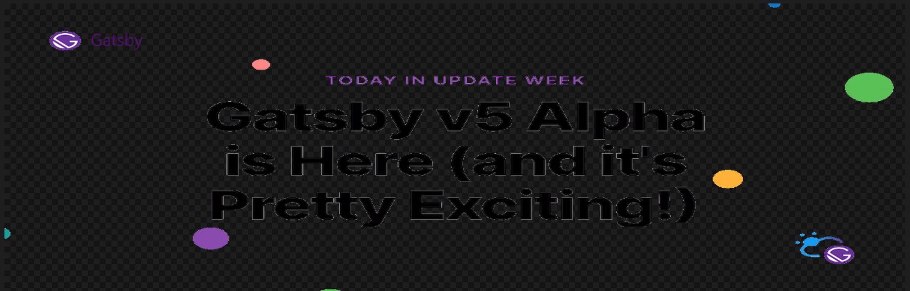

## Gatsby Version Five v5.2.0

This Site uses Gatsby Version `"gatsby": "^4.24.7"`, with React `18.2.0` Node `18.12.1` with NPM `8.11.0`.

After I posted this it was Gatsby version 5.0.0 / 5.0.1 and Gatsby core not MDX had its API as "unstable_shouldOnCreateNode" ->  Gatsby got ahold of this page and now denied anyone to use MDX 3.20.0 in future Gatsby releases by renaming that API from gatsby core to "shouldOnCreateNode".

Now I cannot use Gatsby 5.2.0, with MDX version 3.20.0, it will not work now and MDX 5.0.0 is trash, Mr. artsy, fartsy messed it up. Go back to your art.

How evil and what a lie they said the api for create node was in MDX but it wasalos I guess in gatsby Core. Fuck head's I am going to NEXT, shit like that sucks and your liers and incompetent.

Do you really think everyone who Uses Gatsby wants to completely rebuild there site when you decide, there could be workaround to upgrades that are effortless but none of the Gatsby community can figure it out. Mr Artsy!

Not all of want to take the time to do that, and I do this everyday and have issues with your non-sense.

Thats what we get for letting a Artist do the core work, Artists suck. Art sucks and only dumb asses do it. 

Gods art is cool but none of care about his art or the Planet.


Tried `"gatsby-plugin-mdx": "5.0.0"` slug errors is all I get. Tried `remark-slug`, `rehype-slug` and Gatsby’s external modules Gatsby recommends.

Gatsby issue's on slug errors only response was it's unfortunate.

What kind of non-sense is unfortunate. It still works just fine with `"gatsby-plugin-mdx": "3.20.0"` as long as you update your queries to where Gatsby version `5.2.0`, still works.

GraphQL schema: Changes to sort and aggregation fields

As per the RFC: Change to sort and aggregation fields API the sort argument and aggregation’s field argument were changed from enums to nested input objects.

This change enabled lower resource usage and faster “building schema” step.

They provide a codemod (via gatsby-codemods) for you to easily convert your queries to the new syntax. Go to your project and run the following in your terminal:

```tsx:title=Codemods
npx gatsby-codemods@latest sort-and-aggr-graphql
```

## Conversion from v4 to v5

<Section>

[Query Conversions](https://www.gatsbyjs.com/docs/reference/release-notes/migrating-from-v4-to-v5/)

That's not changing it to fields slug. Maybe it's possible when they get over unfortunate, what ever that means.

Overall Gatsby’s version five is smoking fast and worth the upgrade.

</Section>

<Section>

## The fastest Gatsby Yet

The Gatsby 5 is here and it’s awesome!

This article will teach you everything you need to know about the new Gatsby v5 and all its cool new features.

With Gatsby 5’s new Slice API for supercharged component builds and Partial Hydration to speed up your site performance — updating your website and content at scale has never been easier.

⚠️ This is an Alpha, we strongly recommend trying Partial Hydration on a development branch of your site (no YOLO’s yet, please!).

TLDR; check out the Showcase Video.

</Section>

<Section>

`video: https://www.youtube.com/watch?v=C-WrnfUm33k`

</Section>

<Section>

Updates to non Gatsby NPM modules, that are using old versions of React or GraphQL is a pain. I just turn them into components, update the react calls and change from prop-types, to using typescript `.tsx` adding types or interface types for my conversion's.

</Section>

## Partial Hydration

<Section>

Gatsby is unlocking more frontend performance capabilities for developers by introducing Partial Hydration to the framework.

This will allow teams to ship only the necessary JavaScript to the browser in order to support interactive elements, thereby eliminating bundle bloat that has historically limited the frontend speed for modern websites.

Check out the Partial Hydration [RFC](https://github.com/gatsbyjs/gatsby/discussions/36608) with the instruction on how to play around with the feature today

</Section>

<Section>

`video: https://www.youtube.com/watch?v=lgc6SrINnSc`

Using Partial Hydration flags in gatsby-config.ts

</Section>

```ts:title=Flags-for-gatsby-config.ts
import type { GatsbyConfig } from 'gatsby'
 ...
const config: GatsbyConfig = {
  flags: {
    PARTIAL_HYDRATION: true
  },
  siteMetadata: {
    ...
```

<Section>

WOW this cut the size of my build output in about half from, Gzipped All `(645.3 KB)` to All `(387.3 KB)`.

Maybe it was not building the components without "use client", well see.

So adding the hydration flag is really cool but you have to refactor your components to accept this change.

</Section>

```ts:title=Use-Client
/**
 * To mark a component as client side, you add the "use client" directive.
 * @see {@link https://github.com/reactjs/rfcs/blob/main/text/0227-server-module-conventions.md}
 */
"use client"
```

<Section>

Without `"use client"` you get the below error so its worth the add work.

`ERROR #80000`

Building partial HTML failed for path "/offline-plugin-app-shell-fallback/"

This can happen if interactive elements like "useEffect", "useState", "createContext" or event handlers are used in a component  
without declaring the "use client" directive at the top of the file.

Consider adding "use client" to the top of your file if your component is interactive, otherwise refactor your component so it  
can be statically rendered with React Server Components (RSC).

See our docs page for more info on this error: https://gatsby.dev/partial-hydration-error

TypeError: Cannot set properties of undefined (setting 'props')

Of which I have not done yet, but I will work on it and update this page.

</Section>

## Slices API

<Section>

Content Editors enjoy lightning-fast builds when making content changes in the source CMS thanks to Gatsby’s Incremental Builds.

However, when content changes on a broadly shared component in a site — like a header, footer, or shared site navigation — all pages would typically be rebuilt.

Gatsby v5 allows developers to designate specific components as highly shared throughout the site via Slices.

Gatsby builds Slices separately and then assembles them with the pages that use them, thereby dramatically reducing build times for content changes to these highly shared components.

No more waiting for a full site builds when navigation content changes! Content editors, rejoice! In our tests, this can yield up to a 90% reduction in build duration for content changes to highly shared components.

Slices API is not part of the v5 alpha as we are still making some tweaks but will be part of the Gatsby v5 Beta, coming soon.

</Section>

## Breaking Changes

<Section>

Our goal with Gatsby 5 is to have a smooth upgrade experience, especially coming from v4.

Here’s a list of the breaking changes.

</Section>

## Requirements

<Section>

- Minimum required Node.js version >= 18

- Minimum required React version >= 18

- Removal of `<StaticQuery />` component to using, (useStaticQuery)

- Non-ESM browsers are not polyfilled by default

- GraphQL schema: changes to sort and aggregation fields which make Gatsby more performant and lower resource usage

As you can see, most of these items will have low to no impact on your gatsby project in most cases.

</Section>

<Section>

## Where to go from here

Gatsby v5 is here! This is _the_ version of Gatsby that you need to know about. It’s faster, smaller, and more performant than ever before!

There are many more new improvements beyond these, but we’ll have to wait for the official release.

In the meantime, you can check out the v5 alpha and try it out yourself, and we’d love to hear your thoughts about the alpha in the GitHub discussion!

Version Gatsby Version 5.2.0 is now out and out of Alpha stage. Convert and update you Gatsby site now for shocking performance and Love.

</Section>

<WavyHr className="mt-1 mb-1 text-fuchsia-600" />
