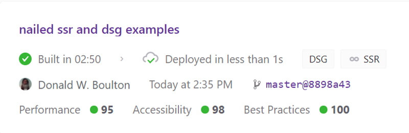

## Gatsby Coolness

## Static Site Generation

> One downside of SSG is longer build times.

As the number of pages of your site grows, so does the build time.

Gatsby supports incremental builds to make sure the 2nd and subsequent builds only rebuild the parts of your site that changed, but for the initial build (the build without the cache), build times may become an issue.

## Differed Static Generation

That’s where Deferred Static Generation could be beneficial.

> The performance of static sites without all of those long build times.

### Dsg Example

🔗 [DSG Example Page](/dsg)

The benefits of statically generated websites - performance, security, reliability - are now available to websites of all shapes and sizes, giving teams a new way to build and deliver digital experiences at scale.

## Server Side Rendering

> Request and render data at run-time with Gatsby.

### Ssr Example

🔗 [SSR Example Page](/ssr)

Gatsby 4 now supports Server-Side Rendering, giving developers the choice of generating content at either build time, as with static-site generation, or at run time. With Server-Side Rendering, teams can now run more effective A/B tests, personalize content, and more all while still using the Gatsby framework.

## My Ssr Page

Node fetch was killing this so to isomorphic-fetch, and it worked perfect.

Lowered my LightHouse Performance score from 99 to 95. It goes up and down???

### Excerpt From Medium

🔗 [Medium by Eduardo Valencia](https://medium.com/@8025918/gatsby-4-using-ssr-and-dsg-14742eaecb66)

With static generation or deferred static generation, Gatsby builds the website’s files only once. With server-side rendering, however, a server builds each page each time the user visits it.

Server-side rendering is useful when your pages update frequently. For example, you might build an e-commerce application where products’ prices and descriptions update frequently. In Gatsby 4, you would have to rebuild the application each time you wanted to update the product data.

In contrast, server-side rendering can rebuild the product page each time a user visits it, so the page will always show the latest product information. By using server-side rendering, you can update pages automatically without needing to rebuild your entire website.

> ## Build Output
>
> (SSG) Generated at build time ,
>
> > D (DSG) Deferred static generation - page generated at runtime
>
> > ∞ (SSR) Server-side renders at runtime (uses getServerData)
>
> > λ (Function) Gatsby function

## Four Cool Things

You Can Build with Gatsby v4

`youtube: https://www.youtube.com/watch?v=9EX36Gtl89I`

🔗 [See More About Gatsby Version Four](https://www.gatsbyjs.com/gatsby-4/)

<WavyHr className="mt-1 mb-1 text-fuchsia-600" />
