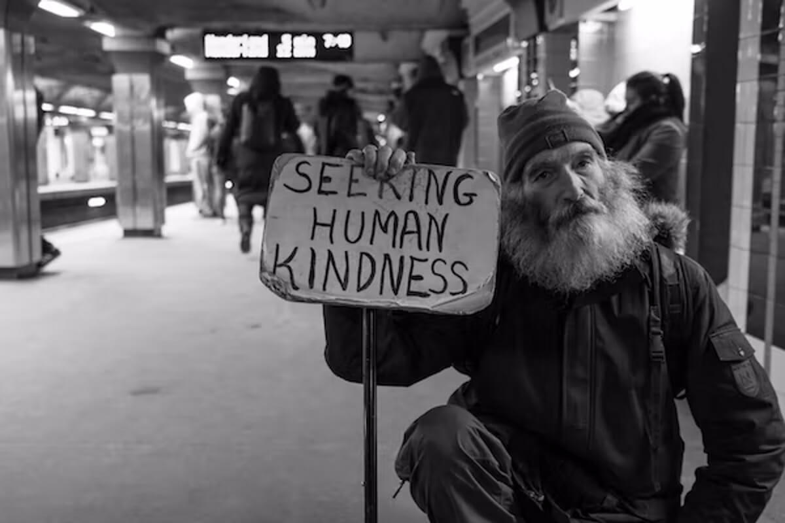

Hard Times

I am the worlds top expert on Homelessness, I will prove it. I am extremely pissed at the people in the homeless industry with their thieving ways.

I will used OKC for an example, and am not sorry about ripping you apart with my words. And soon my actions.

This topic surrounds the Homeless industry who steals all the homeless peoples donated and GOV money's.

The homeless black and white may get Shelter or group housing and the rich get richer off of homeless money. OKC is the worst I seen all over the country, a total Homeless Alliance racketeering scheme.

Our mayor uses all the Money for surveys, studies and board members. So the rich get richer on money allotted for the poor.

> Your horrible daemon's OKC GOV.
>
> > You do nothing but evil, as you have already been judged, and spend all of our tax dollar's on vanity playtime.

<Section>

## Homeless Alliance

</Section>

<Section>

Homeless Alliance is a bunch of Rich scum in alliance to steal the homeless money, they have been doing this for over 10 years. 

We still have most of the homeless people I know are still homeless.

Most of them would like homes or apartments, but the Homeless Alliance offers them group nursing home settings which have curfews limits on visitors, little bitty shitty rooms, no pets = no normal life.

They would rather be homeless, than be locked up in a controlled situation.

Half of the so called Homeless alliance's Flower and Magazine sales people are not homeless and have never been, they can make more money TAX free on the street corner. A lot of them it's there second job, they get more tax free dollars. And the homeless get screwed, these Homeless alliance people will get violent with you if you will not get off of the street corner you are on, and backed by Homeless alliance staff, DAVID you are scum of the earth. 

> I have got a lot of exculpatory evidence on this.

OKC like the rest of the country turns homelessness into a industry with Collage degree programs in how to be a piece of trash so called helper. None of them help the Homelessness, just increase it = job security.

</Section>

<Section>

## Psychobabble

</Section>

<Section>

<LeftText>Law Professor and Neurologist Dr. Amy Wax</LeftText>
<ColumnGridTwo>
<UserProfile buttonLink="https://www.youtube.com/watch?AhyeUd7vOe4" title="By: Gad Saad" titleLink="https://www.youtube.com/watch?AhyeUd7vOe4" link="https://www.youtube.com/watch?AhyeUd7vOe4" description="Dr. Amy Wax">

</UserProfile>
<VideoWrapper>
<YouTube youTubeId="AhyeUd7vOe4" />
</VideoWrapper>
</ColumnGridTwo>

</Section>

<WavyHr className="mt-1 mb-1 text-wine-300" />
