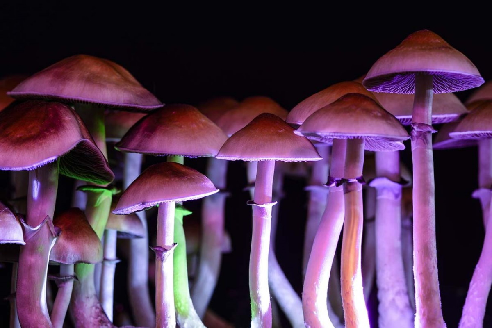

## Shrumers Man

I will add some stories about Shrumers later.

Father God through our creator, "Angelina Jordan", gave us all things in perfection. 

All cures are in nature. Every yes has a no, whatever you can prove you can un-prove. 

Every state has an opposing state, so logic would dictate for every ailment there is a cure. 

Been doing LSD, "Lysergic acid diethylamide", shrumers, 4 way window pane, blotter, Chocolate Mescaline was my favorite, and so on and so forth... and such since 1968, been out there, and came back to a clearer World. 

I have puddled by the best, at the Acid Test / Matel Fest, above Pacific Lumber. 

Ask sarge, if you on the Bus with Keith and Catty, or are you off the Bus. 

I kept getting on and off the Bus, how about you Russell?

<YouTube youTubeId="qwh1SqWxW3E" autoPlay="true" />

> Portlanders flock to store to buy illegal psychedelic mushrooms: 
>
> > A part of history'

Taken From: [Fox Business Full Article](https://www.foxbusiness.com/retail/portlanders-flock-store-buy-illegal-psychedelic-mushrooms-part-history)

Portlanders are forming long lines to buy psychedelic mushrooms at a store in the city, despite recreational mushroom sales still being [illegal in Oregon](https://www.foxbusiness.com/category/fox-news-oregon).

## Psilocybin mushroom

From Wikipedia, the free encyclopedia, [Magic Mushroom](https://en.wikipedia.org/wiki/Psilocybin_mushroom)

`Psilocybe semilanceata`

Psilocybin mushrooms, commonly known as magic mushrooms, are a polyphyletic informal group of fungi that contain psilocybin which turns into psilocin upon ingestion.[1][2] Biological genera containing psilocybin mushrooms include Copelandia, Gymnopilus, Inocybe, Panaeolus, Pholiotina, Pluteus, and Psilocybe. 

Psilocybin mushrooms have been and continue to be used in indigenous New World cultures in religious, divinatory, or spiritual contexts. 

Psilocybin mushrooms are also used as recreational drugs. 

They may be depicted in Stone Age rock art in Africa and Europe, but are most famously represented in the Pre-Columbian sculptures and glyphs seen throughout North, Central and South America.

<WavyHr className="mt-1 mb-1 text-fuchsia-600" />
