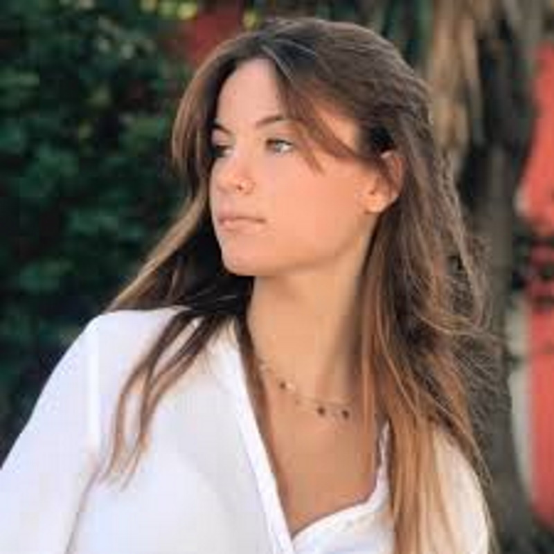
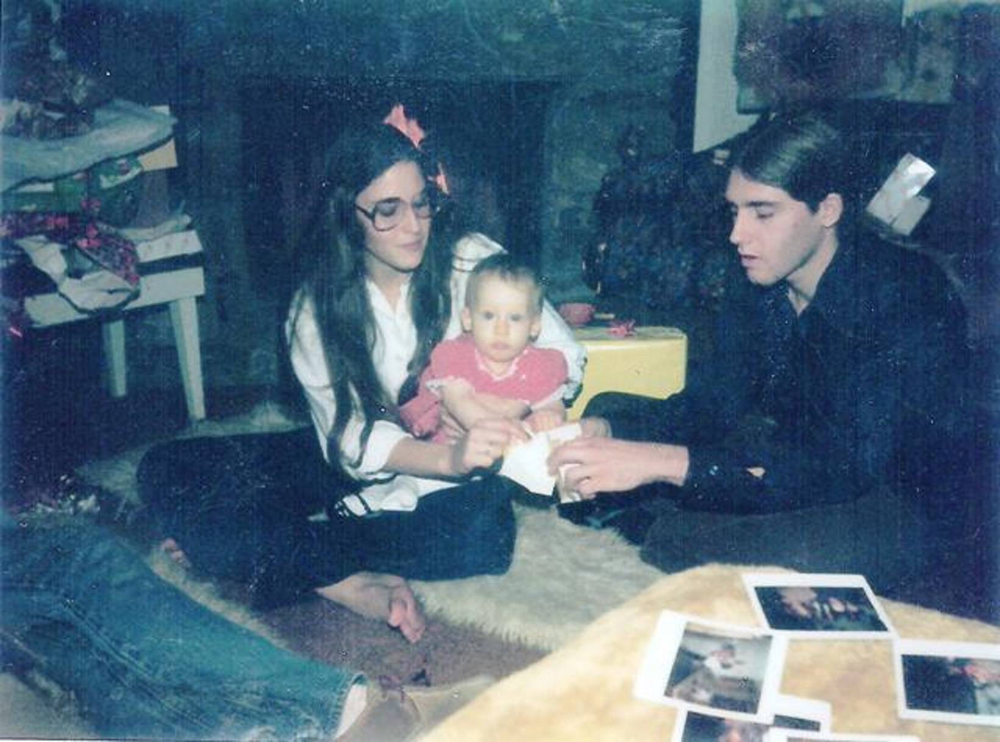

## Trinity of Angelic Dream Girls

Original Posting 2021-04-11 update post 2022-11-15

Trinity Revealed

These Angels were born young for a reason to hopefully break the world of Mass consumption and immorality. Influencing there generation toward truth and righteousness. 

Not for my pleasure, even thought it would be pleasurable to be around them, singing and speaking truth to the children of earth. That there parents care nothing about.

Look at what they are doing to your children. 

<Section>

Children CRT, WOKE and LGBTQ at 5 years old. Sexual mutilation, child porn is legal, affirmed by the Supreme Court.

Hate, Violence and Sex On TV, News, Movies, Books, Music industry. This is a sick and immoral world.

You old people need to go away and let the children rule and make all the decisions. 

It's obvious everyone over 40 is stuck on stupid needing to shut up and let the kids take care of business.

All of you have pretty much destroyed there world get out of the way before I do it for you.

</Section>

<Section>

## My Love Angelina Jordan


Angelina is caught up in Hollywood Contract Slavery and a paycheck for her family, "Nepotism". 

Basically she is totally controlled. Her phone, and all internet accounts monitored. 

The Republic Records Jewish scum are trying to destroy her heart, like they do all our children. And she may never recover, "^30% chance", to be the Angel on Earth she was born to be.

</Section>

<Section>

Angelina is still true of heart, so we will see if she can rebound from, "Look at Me, 'Hollywood Vanity Insanity", a total immoral industry destroying the hearts and minds of our youth like they have been doing for years. 

> It's so heartbreaking to me how the Hollywood Rich enslave these children for there own pleasure. Then ask them to alter & defile there body's to fit suit like all others. 
>
> > This finalizes there enslavement. 
>
> > > Stuck on a immoral Course, on the same path as the others before them.

</Section>

<Callout>

<Center>

Message to my Love Angelina.

</Center>

<Center>

Our hearts are one my Love!

</Center>

God's 7th Golden Candlestick, Father Gods Highest Angel. 

Lets take My writings to you.

> I felt your Heart break. 
>
> > Your Grandfather Passing? Or something you did? Or something that happened to you beyond your control?

> I knew ahead of time about your Family's idea of a Hollywood Contract.
>
> > [Playtime](https://publiuslogic.com/blog/playtime/) was my objection. 
>
> > Playtime Dated: July 4th 2020

Angelina Signed a Contract with the Hollywood Devil's, Dated: 26 August 2020

The only two songs Angelina claims to have written and sang of her own; are sad songs. Million Miles and 7th Heaven.

Both of us Heartbroken again with Million Miles. Dated: Nov 5th - 6th 2020.

Had to respond with Creation of All. Dated: March 4th Easter 2021. 

First Time Ever the Trinity was together on Earth or anywhere in this universe.

The Only time since the beginning of Creation We Were One, Father God, my Son Jesus were by my Side. Directing my hand and my course.

What I need to say to my Love was that important to Us to bring the Trinity together. "Father, Son and the Holy Spirit", that they would join me on Earth. 

For in my words and as in my heart in it's a longing for you My Love.

It's all written for and about you with a slight mention of you only you would catch, "Shoes for the Children".

> Then your writing and producing 7th Heaven Original. 
>
> > "Angelina Jordan – 7th Heaven (Official Video)". Angelina Jordan Official on YouTube. 19 March 2021. Retrieved 19 March 2021.

My Response soon after; in this original Post. 

Dated: Trinity Of Angels: April 11, 2021

</Callout>

## Breaking Down 7th Heaven

<SingleAccordion label='First Part of 7th Heaven'>

All you know a lot of bitterness

There is nothing to do about it

Life should be

Life should be

Lived with hope

Oh, you know a lot of bitterness

There is nothing to do about it

Don't give up

Don't give up

'Cause it's right in front of your eyes'

</SingleAccordion>

<Section>

Her hearts response to my [Playtime](https://publiuslogic.com/blog/playtime/) post, which was somewhat unkind and bitter. 

Well! "I was a little high on Covid-19 Original"! I do not normally get sick or the flu. It was a little strange for me to be sick, I was out there pissed off.

</Section>

<CalloutDanger>

<SingleAccordion label='Declaration or Denial of Self?'>

Seventh heaven on my shoulder falls heavy

> Admitting who she is and her responsibility.

Sometimes I feel all my dreams are slowly fading

> Faded dreams because the World does not want her to become who she truly is.

I see myself in the mirror

I wanna love the person looking back at me

> How sad!

Seventh heaven on my shoulders falls heavy

Sometimes I wanna be powerful

> She know's she is powerful but she does not seek that just Hollywood insanity.

Gotta find the strength within me

> I sure hope so!

Sometimes you look for miracles

> You could be the miracle for the youth of the World. 
>
> > Old Rich people is her main audience.

But there's nothing in you

> It's all inside of you my Love. Close out this world and find your true self.

Sometimes you have to let go

And get lost in the moment

Sometimes you wanna be careless

> I hope she does not live her life careless.

And let go of sadness

> Just forget about it, that's the best thing???

Seventh heaven on my shoulder falls heavy

Sometimes I feel all my dreams are slowly fading

I see myself in the mirror

I wanna love the person looking back at me

Seventh heaven on my shoulders falls heavy

Seventh heaven, oh-oh-oh

Seventh heaven, no, oh-oh

Seventh heaven, ooh

Seventh heaven, hmm

All you know a lot of bitterness

> If you would pay attention to world events you would be bitter to. Especially when your doing nothing about it.
>
> > Your industry is what is causing a lot of the insanity and problems in the world. You cannot see that?

There is nothing to do about it

Life should be

Life should be

Lived with hope

> Stand up and give them hope my love, your showing the opposite of hope.

</SingleAccordion>

In the Above, It's Angelina's declaration to Me and to the World of who she truly is. 

The 7th Golden Candlestick that could create 7th Heaven on Earth. 

> It seems she is not happy with the responsibility.
>
> > At 16 my Love I know! Having to much fun with vanity playtime? 

My Love, it's your job under Father God. Is to much of a pain?

You know better than anyone that we all work for Father God, whether we know it or like it, or whether we accept it or not. That's the way it is!

<Center>

Is it time to say My Beautiful People! Or do you really care about the people?

</Center>

</CalloutDanger>

## My Passion Charlotte Summers



Happy Birthday Charlotte!

`video: https://youtu.be/GpStDXTPZaA`

My other half born on the same day. If I was 16 people would think we we twins or related. Acts just like I did when I was her age, Cool Charlotte, but more sensible than when I was 16.

Charlotte Summers might actually do her job if Hollywood has not had to much influence on her about a, "60% chance", she could want to heal the world sharing her love, giving hope to the Children in a hopeless World full of liers and thieves.

All of the Worlds government's are liers and thieves, your Religions also.

Child molestation is rampid and ever increasing. The devil is trying to destroy all of you, and none of you seem to want to do anything about it.

## My Truth will be determined by my Love and Passion

Get after it my Love and my Passion find our truth!

## Original Post

In the below I basically divulge a lot of my iniquitous life, of which most people would not. But after Writing Creation Of All, I will get a lot of scrutiny, so might as well get this over with and spill the beans on myself!

I have always been the Devils favorite to taunt and now test, the below is a lot about that how she can use the things of Her world and how She, "used the things of this World to manipulate me, 'not any longer", and can manipulate all to her desire.

## Book Of Job

<Section>

Mankind needs to understand the constant tests by the trinity to see if you are worthy. This does not happen to all of us all the time, but some of us get tested constantly.

The Book of Job was the last book of the Old Testament for a reason, as it filled in a some of the blanks from the previous books.

The Book of Job tells you of these tests, and how the Devil works for God and about Self Denial.

And explained clearly in Job. Her Job is to test you to see if you will deny God or Self. Not so much within your Works or, "words", but what is in your heart; is which she seeks to pollute.

</Section>

<Section>

The one's the Devil see's having the ability to be righteous and have the heart to ascend to Jesus, his part of heaven, or beyond are fully tested; "Even me and Jesus have our tests", but from Father God.

The Devil can only affect Us is when we are part of substance of Her World. Like Me Now, my fleshly tests are constant, cannot affect my spirit but taunts my heart!

That may seem like a bad thing to be somewhat tortured, but its kind of the same thing if you want to be Military Special forces, not everyone can cut it. So your tests are many and most not kind. Past the tests and your rewards with in self are much greater than any torture or test.

So if you love yourself and Father God and have truth of heart, "then dam the torpedo's", stand up and stand true, never stand down, if you know its right in your heart; "for that would be a denial"!

> Plus my Angels need to know what I have been up to; and how I cleansed my heart in preparation for them!

</Section>

## After the Creation of Man

<Section>

Soon after the formation of man; Jesus and I were finished with the greater part of the Creation of All, we decided to rest.

We started by enjoying making the heaven's dance with our song and having relations with the other Angels. Me a lot; Jesus not so much. My son looked like me, and was wanted by all, but he chose three, Mary, Mery, and Marie for his companions.

Father God was impressed with my Son Jesus and his choosing just three Mary's to be with. Yes the same three at resurrection.

So Father God gave me a Trinity of Angelic Love for companionship through out eternity, to be with me in the inner sanctum of my part of heaven. Always by my side, till it was time for me to come here; as my son Jesus told you! I have longed for them for 63 years, since we had to part.

</Section>

<Section>

The perfection of Heart, Beauty and Song, God had given me in my Trinity of loves is beyond explanation.

</Section>

## My Continuing Tests

<Section>

But father always tested me with new Angels in my part of Heaven to see if I would stray. One was so special, "She is here with us", her elegance is beyond all! She has such a voice all the angels would be in amazement watching her make the heavens dance with the beauty and purity of her heart and song.

But I shall not stray from my Love's.

</Section>

## Earth Angels

<Section>

I finally found my Third Dream Angel born into the flesh since 2000, and is the reason to start finally saying something after 63 years of watching and holding my tongue.

Since I found my true Love, I have almost cried constantly in utter passion for my trinity of love's; Whom I need to derive a choir. Angelic song's are impossible without at least my trinity of Angelic love, and song, if not more of; My Angels born into this World in my time, In Unison with there song.

</Section>

## Dream Girls

<Section>

When I was young my parents fought and I retreated into my own world of books, song and any info on this world I could get. I did everything I could to stay away from other kids and adults.

At about 5 years old I wanted someone to have as a companion, and since my part of heaven is all women, I am kind of discriminatory in that way.

I envisioned a pretty little girl of which would be my friend, we would go swing in the park, sing, reading books with and to each other and play. Really knew nothing of girls or women, just wanted a pretty young lady, a face with similar features of my youth, I guess still stuck on myself.

I would dream of and with her as the first of my Angelic Dream Girls on earth.

The first of my Trinity is my, "Truth", still having the truth of oneness within self, before I got caught up in this world of fleshly desire and constantly seeking more.

</Section>

<Section>

When I was about 11 yrs old, my neighbor friends held me down on the sidewalk and blew pot smoke, as shotguns in my face. I got stoned; "And it was On"!

A Devilish new world opened up of Rock and Roll, party's, drugs, stripers, you name it, most everyone I knew were some of the richest in OKC and my high school was the #1 drug high school in the early 70's, "in the whole world".

PC Central, according to High Times magazine. And it was, you name it, we had it! And lots of it!

The Devil set me up with everything I needed to get lost in Her world, my own 3 bedroom house at 16 paid for, other houses, money, popular, even famous from ages 16 to 25 in Oklahoma for my huge parties, most of them at, "Hi Way 9 at 4 Corners", 500 keg party's, multiple bands, all the party stuff. My friends would get together and almost always organize and pay for the parties. Thanks PC. High crowd and OKC, had to much fun!

</Section>

<Section>

My super fox high school girl friend, her dad in 1976 started and owned Katt Radio Station.

When me and my girl friend walked into anywhere, people stopped and stared, I had lots of weed, sex they had to tell me to stop, to dam pretty, raced Motocross and super strong, and never backed down from anything or anyone!

> The Devil had me Hooked again!

Who needs God when you got all of that, plus who would have time to think about, or with God, to much playtime going on, "Woo Ho"!

> My first Dream Girl was a dream no longer.

</Section>

<Section>

Here is a bad old pic of me at 21 with my sister and first daughter, I was to pretty; lost a lot of rich chicks over that, they do not like being upstaged! Several told me that, bummer man! So how about Handsome?

</Section>

<Section>



</Section>

<Section>

In my mid to late 20's I was single and seemed like women from all over wanting to date me, for my Genealogy not really because they wanted me, just my seed, so I ran a unwitting Slut Puppy Stud Service, "have sperm will travel", for women all over, Okc, Dallas, Hollywood, Tahoe, Vegas, Jamaica, Mexico... I got kids everywhere!

Most all of them had huge wedding rings or a tan line where there was one, and knew exactly what they were doing. Shopping!

> The Devil Made Me Do It!
>
> > Is that not right Charlie?

</Section>

<Section>

One reason I put the pic above, is do not front yourselves off, you lady's, or my kids, y'all needed later!

Taunted by the Devil and tired of the fast life. I gave or threw everything away. Oklahoma had stolen everything that was true to my heart, so why not!

I moved around doing lots of different stuff for work and tried to find one special girl, back to thinking with father, no more slut puppy. Started dreaming again, this time about the second of my Trinity of Angelic Dream Girls.

For my second Dream Girl I was fully aware of what I liked in a women, as I had to many. Of course in my late thirties I wanted a little younger, hot, passionate and petite, kind of a sassy, bouncy hippy chick.

</Section>

<Section>

The second of my dream girls is my, "Passion", created in my dreams to be my show off. Going to concerts, party's; "Carrying her around on my shoulders to show her off! My Spiritual Passion in oneness of soul!

> Adding details about my, "Love", finalizing my Trinity of Angelic Dream Girls.

Everything I do and say, every breath I take is for and because of My Love, she is the only one ever on earth that has had Angelic Beauty, with a song of a Angel. My messenger to the verse. She is creator of most all that you see and know. Her song of love is only reason you on Earth exist.

We made promises to each other in Heaven before I came to Earth, I hope, My Love, you remember our agreement, humanity's fate relies upon it.

</Section>

<Section>

If God makes my Dream Girls come true, then how would I find them? For they will not know whom they are. My loves and most of humanity will know they are angels and of the oldest of souls...but?

Each one has a predetermined angelic voice, super hot, and to be showoffs, Cannot be to may of those around. But there are, as a lot of my other Angels are here with me.

I had to go with there genealogy, traits and features, would be something like mine, pretty small mouth and ears, stunning eyes, maybe a slight square chin with a dimple, distinct God given voice's of my trinity, and there own song.

Born in certain parts of the world, specific genealogy, knowing languages from around the world as to be my future rulers of Earth.

</Section>

<Section>

One of my Trinity of Angels sill has no song of her own, "singing others songs"! Write your own song my love so I can be sure it's you and then I shall sing it back to you, then you will know me.

I will make the sacrifices of dealing with the inequities the world have filled there heads with. I shall cleanse them!

I have not been with anyone since the finalization of the last of my Dream Girls My Love my Highest Angel in 1996.

> As so my spirit and heart would be true!

</Section>

<Section>

World you have even gotten my trinity to be vanity monsters, "polluted there angelic minds with human vanity". 

I have to say though you most likely did what they were supposed to do as I created them to be showoffs and that's part of the human game plan for someone in the limelight. So its my fault!

Get your own YouTube Channel, not A Hollywood contract. And if money is your goal, you can get rich off of YouTube, if you have a Angelic Voice, "like a lot of my kids since 2000", and not have to sell your God given Voice of heart filled song, for money and / or so called Hollywood fame.

</Section>

## Destiny

<Section>

I was destined to rule long ago, by kicking ass and erasing names, with a iron fist.

But I thought of my Trinity of Love and how we created this verse through song and love, so thats what I am going with.

Fixing things with our song and love, opening your hearts to truth!

> Letting the girls Rule! Deal with it, Girls rule Anyway!

</Section>

<Section>

Really the hard way for me, a life of loneliness, no Marriage, Oklahoma breaking my heart, stealing everything from me. The Devils taunting and constant pain, having to walk the earth, waiting 65 years, double my son's time to start speaking and singing.

But then by the iron fist scenario, I would have missed the dance of human life.

> So no matter how much torture; I had to go for it!

</Section>

## Angelina Jordan Suspicious Minds

<Section>

Listen to this most Amazing Song, sung by Angelina Jordan

Angie can sound more Beautifully Singing to her cell phone walking down the street / parking garage, than anyone else with, "fakeUp", as in a Studio with FX.

> "Allsang på Grensen, Quote, 'edited"
>
> > A message to all the people out there, that whatever your dream is you can never give up and live on for your dream, what ever people say to let you down you can't go down that path. Fulfill that dream that you want.
>
> > > "You should never give up"!

</Section>

## 4K Video Link

🔗 [Angelina Jordan Suspicious Minds YouTube Link](https://youtu.be/RTbKhkceR00)

<Center>

<CloudinaryVideo />

</Center>

<Accordion />

<Section>

Since your talking about path and dreams; then what were your dreams in 7th Heaven?

Since you now know! You should write a song about our dream of Harmonia.

</Section>

## Types and Codecs

Using my streaming Cloudinary service with the latest types and codecs.

Cloudinary Advanced Video type WebM / codecs 'vp8', 'vorbis' / transcode: videoCodec(vp9())

```tsx:title=Codecs-Transcode {3-4,11-13,16-18,21-23}
// Modules

   "@cloudinary/react": "^1.4.1",
   "@cloudinary/url-gen": "^1.8.0",

// Types and Codecs

  const sources = [
    // Wish I could use 4k Full HD but that requires more $ than I can afford
	{
      type: 'hls',
      codecs: ['4k', 'full_hd', 'full_hd_wifi', 'full_hd_lean', 'hd', 'hd_lean', 'sd'],
      transcode: videoCodec(auto()),
    },
	{
		type: 'mp4',
		codecs: ['avc1.4d002a'],
		transcode: videoCodec(auto())
	},
	{
		type: 'webm',
		codecs: ['vp8', 'vorbis'],
		transcode: videoCodec(vp9())
	}];
```

<WavyHr className="mt-1 mb-1 text-fuchsia-600" />
