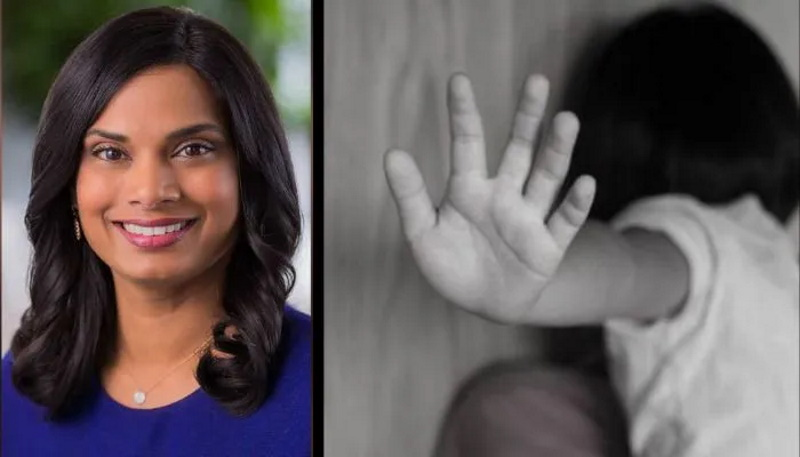

## Twitter Gate Google Gate Facebook Gate

Note: Youtube has in the last month has taken it upon themselves to take down a lot of exculpatory evidence related to covid and Google Gate trying to cover there ass. You only digging yourselves a deeper hold idiot's.

Half the videos on my vaccination page have been blocked as disinformation. Who are you fuckhead's to sensor free speech. 

I got banned from twitter for saying that we used to execute people for whats going on in our GOV.

Past tense, you cannot say execute even if it's repeating history. Elon Musk and Twitter are attacking free speech more than before Elon Got involved.

## Immigrant's are destroying America

There was very little censorship on the internet util these foreign terrorists were allowed in our country. 

Now the censorship in our Computer industry is mostly done by first generation immigrants.

These immigrants come her not to integrate into our society but to change it, to be like where they came from. If you do not like what were in the USA stand for then get the hell out.

Get your Jewish / Chinese / Indian / Pakistani scum trash selves, out of our computer industry's, and medical fields and go back to where you belong before the American people do it for you. 

All of them in power are talking shit about our Country and our Christian Religion. Do you need a list, every immigrant from the last 50 years that is in our Federal GOV are liers and hater's of our country.

Let into our country to do just that. Destroying us internally, of which they pretty much have accomplished it. Most of all of our Collage kids hate America and the others are clueless.

Yes it's come to that point. GET OUT.

## Baned a Sitting President

Former President Donald Trump was banned from Twitter the day after former First Lady Michelle Obama and others demanded the company "permanently" remove him, according to the newest "Twitter Files" installment.

On Saturday, CEO Elon Musk and journalist Michael Shellenberger released the fourth batch of Twitter documents that show internal communications by the company’s executives between Jan. 6-8, 2021, including and shortly after the riot at the Capitol Building.

Among the files, Shellenberger reported "internal and external pressure," including from the former first lady, fell onto the company calling for Trump to be banned from using Twitter.

## Obama Terrorists

"Now is the time for Silicon Valley companies to stop enabling this monstrous behavior—and go even further than they have already by permanently banning this man from their platforms and putting in place policies to prevent their technologies from being used by the nation’s leaders to fuel insurrection," Obama wrote in a lengthy statement posted to Twitter on Jan. 7.

Someone needs to go and wake up Sleepy Joe, because Twitter CEO Elon Musk is airing the social media company’s dirty laundry when it comes to #LaptopGate as if they were episodes on Netflix.

Musk has made good on his threat to reveal the internal communications at Twitter that led to management and ‘community safety’ actively killing the Hunter Biden laptop story, tweeting: ‘Tune in for Episode 2 of The Twitter Files tomorrow!’

‘Episode 1’ of the data dump was made via journalist Matt Taibbi’s Twitter account, @mtaibbi, in a series of tweets that start:

[Above and Below a Thread From](https://www.spectator.com.au/2022/12/leaked-the-twitter-files-hunters-laptop/)

‘THE TWITTER FILES’

<Tweet tweetLink="RepMTG/status/1599958072117510145?ref_src=twsrc%5Etfw" theme="dark" align="center" />

## He writes

What you’re about to read is the first instalment in a series, based upon thousands of internal documents obtained by sources at Twitter.

The ‘Twitter Files’ tell an incredible story from inside one of the world’s largest and most influential social media platforms. It is a Frankensteinian tale of a human-built mechanism grown out the control of its designer.

Twitter in its conception was a brilliant tool for enabling instant mass communication, making a true real-time global conversation possible for the first time.

In an early conception, Twitter more than lived up to its mission statement, giving people ‘the power to create and share ideas and information instantly, without barriers’. As time progressed, however, the company was slowly forced to add those barriers.

Some of the first tools for controlling speech were designed to combat the likes of spam and financial fraudsters.

Slowly, over time, Twitter staff and executives began to find more and more uses for these tools. Outsiders began petitioning the company to manipulate speech as well: first a little, then more often, then constantly.

By 2020, requests from connected actors to delete tweets were routine. One executive would write to another: ‘More to review from the Biden team.’ The reply would come back: ‘Handled.’

Celebrities and unknowns alike could be removed or reviewed at the behest of a political party. Both parties had access to these tools. For instance, in 2020, requests from both the Trump White House and the Biden campaign were received and honoured.

However: this system wasn’t balanced. It was based on contracts. Because Twitter was and is overwhelmingly staffed by people of one political orientation, there were more channels, more ways to complain, open to the left (well, Democrats) than the right.

The resulting slant in content moderation decisions is visible in the documents you’re about to read. However, it’s also the assessment of multiple current and former high-level executives.

Okay, there was more throat-clearing about the process, but screw it, let’s jump forward. The Twitter Files, Part One: How and Why Twitter Blocked the Hunter Biden Laptop Story…

The suppression of the Hunter Biden laptop story was a watershed moment in American politics and the relationship between social media and political institutions.

Hunter Biden, the son of then Presidential candidate Joe Biden, left his laptop at a repair store in Delaware in 2019 and forgot to collect it. Three weeks prior to the presidential election in 2020, the New York Post went to print with information collected from the laptop that ‘suggested possible corruption’ involving Joe Biden.

It was a scandal in the making.

## According to Matt Taibbi

Twitter took extraordinary steps to suppress the story, removing links and posting warnings that it may be ‘unsafe’. They even blocked its transmission via direct message, a tool hitherto reserved for extreme cases, e.g. child pornography. 

President Donald Trump unsurprisingly tried to help the story along. It was relevant to the election and in the public interest. By all rights, Hunter’s laptop should have been allowed to trend at the top of the news cycle.

At the time, tens of thousands of emails found on the laptop had already been independently verified by forensic analysts for The Washington Post. This already made it more credible than the ‘Russian Collusion’ nonsense that received wall-to-wall coverage without so much as a second look from Twitter.

Instead, a lot of garbage about the laptop’s ‘chain of custody’ was dressed up as an excuse for social media giants, including Twitter and Facebook, to bin not only the story (and the original tweet from the New York Post) but prevent users from sharing it. Twitter also temporarily locked President Donald Trump’s campaign account after sharing a video of Hunter Biden – an action that added to public outrage and a feeling that social media had become too powerful in the political sphere.

White House spokeswoman Kaleigh McEnany was locked out of her account for tweeting about the story, prompting a furious letter from Trump campaign staffer Mike Hahn, who seethed: ‘At least pretend to care for the next 20 days.’

This led public policy executive Caroline Storm to send out a polite WTF query. Several employees note that there was tension between the comms/policy teams, who had little/less control over moderation, and the safety/trust teams.

Storm’s note returned the answer that the laptop story had been removed for violation of the company’s ‘hacked materials’ policy.

A letter from Elaine Ong Sotto, Ops Analyst Global Escalations Team, was attached and read: ‘Thanks for reaching out to us. Per checking, the user was bounced by Site Integrity for violating our Hacked Materials policy. Adding them here for further insights and guidance. Thanks.’

Before outright censoring the story (in the middle of an election campaign), Twitter used algorithms to push the story out of the public eye.

Many accused the social media giant of meddling in the election and wrongly acting as a publisher by gagging the press. Their actions were (weakly) explained through the Hacked Materials Policy – something that has failed to hold water. Matt Taibbi comments further on this.

Although several sources recalled hearing about a ‘general’ warning from federal law enforcement about possible foreign hacks, there’s no evidence – that I’ve seen – of any government involvement in the laptop story.

In fact, that might have been the problem. The decision was made at the highest levels of the company [Twitter], but without the knowledge of CEO Jack Dorsey, with former head of legal, policy and trust Vjaya Gadde playing a key role.

‘They just freelanced it,’ is how one former employee characterised the decision. ‘Hacking was the excuse, but within a few hours, pretty much everyone realised that wasn’t going to hold. But no one had the guts to reverse it.’

Taibbi then posts examples of the exchanges between former Trust and Safety Chief Yoel Roth and Gadde, and Comms official Trenton Kennedy who was quoted saying, ‘I’m struggling to understand the policy basis for marking this as unsafe.’

Yoel Roth wrote: ‘When you click the link, you’ll see the generic unsafe URL message (references spam, malware, and violations of the Twitter Rules) – not ideal, but it’s the only thing we have.’

To which Ian Plunkett replied: ‘Whatever we do in the comms (this will become a bias claim for Jack [Dorsey] pre-hearing immediately), let’s make it clear we’re proactively but cautiously interpreting this through the lens of our hacked materials policy and allowing the link with a warning and significant reduction of spread.’

And then Brandon Borrman, former Vice President of Global Comms, stepped in: ‘To Ian’s point, can we truthfully claim that this is part of the policy? i.e. As part of our approach to addressing potentially hacked materials, we are limiting visibility of related stories on Twitter while our investigation is ongoing.’

He is replied to by former Deputy General Counsel Jim Baker: ‘I support the conclusion that we need more facts to assess whether the materials were hacked. At this stage, however, it is reasonable for us to assume that they may have been and that caution is warranted. There are some facts that indicate that the materials may have been hacked, while there are others indicating that the computer was either abandoned and/or the owner consented to allow the repair shop to access it for at least some purposes. We simply need more information.’

There is a veritable storm of emails birthed from this decision, but one interesting comment comes from Democratic congressman Ro Khanna who writes to Gadde expressing concern:

‘Hope you’re well Vijaya! But this seems a violation of the 1st Amendment principles. If there is a hack of classified information or other information that could expose a serious war crime and the NYT was to publish it, I think the NYT should have that right. A journalist should not be held accountable for the illegal actions of the source unless they actively aided the hack. So to restrict the distribution of that material, especially regarding a Presidential candidate, seems not in keeping of the principles of NYT v Sullivan. I say this as a total Biden partisan and convinced he didn’t do anything wrong. But the story has now become more about censorship than relatively innocuous emails and it’s become a bigger deal than it would have been.

‘It also is now leading to serious efforts to curtail Section 230 – many of which would have been a mistake.

‘I believe Twitter itself should curtail what it recommends or puts in trending news, and your policy against QAnon groups is all good. It’s a hard balance.

‘But in the heat of a Presidential campaign, restricting dissemination of newspaper articles (even if NY Post is far right) seems like it will invite more backlash than it will do good.

‘Please keep this communication between just us and Jack and no need to cc the team or forward to them.

‘Just wanted to offer my two cents.’

Congressman Ro Khanna was right to be worried, with Taibbi writing that NetChoice had informed Twitter of an awaiting ‘blood bath’ in the upcoming Hill hearings where it was reported that Twitter’s interference during #LaptopGate showed that tech companies had ‘grown so big that they can’t even regulate themselves, so government may need to intervene’.

Taibbi finishes by highlighting the reason that Jack Dorsey may have been giving blank looks throughout the hearings and adopted a ‘Taliban-chic’ appearance.

An amazing subplot of the Twitter/Hunter Biden laptop affair was how much was done without the knowledge of CEO Jack Dorsey, and how long it took for the situation to get ‘unf*cked’ (as one ex-employee put it) even after Dorsey jumped in.

‘Our communication around our actions on the New York Post article was not great,’ admitted then-CEO of Twitter Jack Dorsey. ‘Blocking URL sharing via tweet or [direct message] without explaining the context was unacceptable.’

When questioned, Facebook (who had engaged in similar behavior) explained that their decision had been ‘informed’ by an FBI warning, an admission that has damaged both Facebook and public trust in the FBI.

The mess led to a Senate Judiciary Committee for Facebook and Twitter, with Dorsey trying to explain the error as ‘literally just a process error’ and that ‘this was not against them [the New York Post] in any way’.

Eventually, a Federal Election Commission inquiry dismissed a complaint about Twitter’s interference in the US election, failing to find evidence that they had acted on ‘purely political grounds’.

This is not the end of the story for Matt Taibbi who, under Elon Musk’s guidance, will be returning to post more.

This is much more to come, including answers to questions about issues like shadow-banning, boosting, follower counts, the fate of various individual accounts, and more. These issues are not limited to the political right.

If nothing else, Musk should be thanked for tearing the curtain of Silicon Valley secrecy to shreds.

It’s no wonder that Twitter was prepared to take a poison-pill to stop its sale. For years, Twitter has been accused of manipulating politics and curating the truth.

The way to erode the power of social media is not to allow self-interested politicians to legislate it, but to sit back and watch a CEO like Elon Musk flood the public forum with the facts – as they happened – and allow the people to decide.

## Twitter Child Porn Site

As ‘censor chief’ Vijaya Gadde is fired, read how Twitter had refused to take down child porn even as victim’s parents begged for its removal

In 2021, a 17-year-old boy alias ‘John Doe’, filed a lawsuit against Twitter for not removing two child pornography videos featuring him, despite multiple requests to the social media giant. 

The victim informed us that the videos were shot when he was just 13 years old. 

He accused Twitter of allowing the dissemination of disturbing videos and profiteering from his traumatic experience.

The scum trash LBGTQ has destroyed all truth in our World all morals, all values, God Hating Scum. 

Goodby useless trash!

<WavyHr className="mt-1 mb-1 text-wine-300" />
